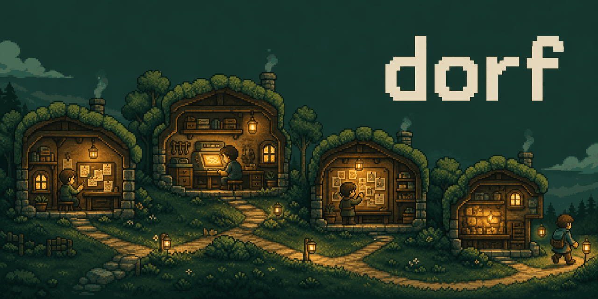

<picture>
  <source media="(prefers-reduced-motion: reduce)" srcset="assets/cover.png">
  
</picture>

# Dorf

**Durable AI workers on infrastructure you control.**

Dorf makes your coding agent a durable worker—Codex today, more harnesses over time. Give it a job,
walk away, and come back to the same work.

Each Worker gets a full development environment for its native tools and workflows. The Room keeps
that work isolated from the rest of your infrastructure.

## Run a coding Job

Install Dorf and run the one-time guided setup:

```bash
uv tool install dorf
dorf setup
```

See [Getting started](https://github.com/aphronio/dorf/blob/main/docs/getting-started.md) for current
prerequisites and setup details.

Then create a Worker and give it one complete goal:

```bash
dorf worker spawn python-developer

dorf job assign build-retry-queue \
  --to python-developer \
  --goal "Build a small Python retry queue with tests, run them, and publish the results as evidence."

dorf job wait build-retry-queue
```

Close the terminal while the Job runs, then return from another shell:

```bash
dorf job inspect build-retry-queue
dorf job message build-retry-queue "Add a test for exponential backoff and publish the new results."
dorf job wait build-retry-queue
```

## Workers do Jobs in Rooms

| Resource | Meaning |
| --- | --- |
| **Worker** | Durable identity around an agent harness |
| **Job** | Pinned goal with its own conversation and retained evidence |
| **Room** | Isolated environment supplied by a Room provider |

An **Assignment** records the exact Worker, Job, and Room binding for lifecycle and recovery. Most
human-facing commands need only the Worker or Job name.

Workers wrap the harnesses developers already use; they are not a replacement agent framework. The
control plane is harness- and sandbox-provider agnostic by design. Codex and local Incus VMs are the
only supported adapters today; other harnesses and local or cloud VM providers can fit the same
boundaries once validated.

## Why Dorf

- **Leave without losing the thread.** Worker and Job identity survive the client that started them.
- **Return to the situation, not a transcript.** Inspect state, timeline, and evidence without
  asking the Worker to recap.
- **Let the harness do its best work.** Give it a complete development environment and contain that
  environment with a clear isolation boundary.
- **Build workflows above the runtime.** Dorf owns durable execution; applications own policy,
  acceptance, and presentation.

## Alpha status

Dorf is alpha software. See [Setup support](https://github.com/aphronio/dorf/blob/main/docs/support.md)
for current adapters, host requirements, and limitations.

## Coding-to-PR showcase

Coding-to-PR is the first application built on Dorf, not the runtime's identity. It takes a coding
task from an isolated workspace through checks, review, follow-up, and a PR proposal.

```bash
dorf start "Fix the checkout timeout and add a regression test"
# Or leave an issue running unattended:
dorf afk 42
dorf job inspect JOB
dorf job inspect JOB --json  # structured outcome pulse for agents
dorf verify JOB
# Optional shadow diff-correctness role in its own disposable Room
# (explicit opt-in; automatic AFK composition is a later step):
dorf verify-role JOB diff
dorf publish JOB
```

New coding Jobs use the Provider Connection selected by `dorf setup`. Pass
`--provider-connection NAME` only to intentionally override that host-local default.

The official `dorf-codex` image is the coding workstation: repository preparation and checks come
from the cloned repository's contract, while GitHub access remains a separately scoped host-side
integration. See the
[North Star](https://github.com/aphronio/dorf/blob/main/docs/project/north-star.md) for how it fits
the broader runtime.

## Build on Dorf

Build workflow-specific applications with the experimental Python SDK. It exposes the same Worker,
Room, Job, and Assignment controls used by the CLI; coding-to-PR is the first example.

```python
from dorf import Dorf


def run_coding_workflow(task: str) -> str | None:
    with Dorf.open(provider_connection="personal-chatgpt") as dorf:
        dorf.spawn_worker("developer")
        dorf.assign_job(
            "implementation",
            worker_name="developer",
            goal=(
                f"{task}\n\n"
                "Acceptance:\n"
                "- Run the repository checks.\n"
                "- Publish the results as evidence."
            ),
        )
        result = dorf.wait_for_job_input("implementation")
        if result.outcome != "done":
            raise RuntimeError(result.detail or result.outcome)
        return result.response
```

The SDK is experimental and does not yet carry a third-party compatibility promise. See the
[Runtime Surface](https://github.com/aphronio/dorf/blob/main/docs/project/runtime.md) for the current
responsibility boundary.

## Learn more

- [Documentation](https://github.com/aphronio/dorf/blob/main/docs/README.md) — choose a path by
  what you are trying to do
- [Getting started](https://github.com/aphronio/dorf/blob/main/docs/getting-started.md) — create your
  first Worker and Job
- [North Star](https://github.com/aphronio/dorf/blob/main/docs/project/north-star.md) — approved
  product direction
- [Setup support](https://github.com/aphronio/dorf/blob/main/docs/support.md) — host support,
  diagnostics, and troubleshooting
- [Contributing](https://github.com/aphronio/dorf/blob/main/CONTRIBUTING.md) — development workflow
  and DCO sign-off
- [Security policy](https://github.com/aphronio/dorf/blob/main/SECURITY.md) — private vulnerability reporting

Dorf is licensed under the [Apache License 2.0](https://github.com/aphronio/dorf/blob/main/LICENSE).
