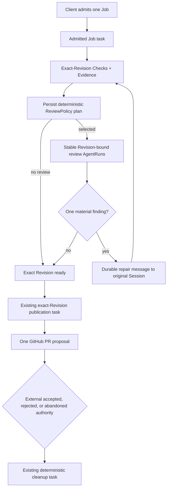

# Go Review Policy and Revision-bound AgentRuns

Issue #42 extends the explicit Go coding phase machine after independently verified, exact-Revision
Checks. It does not add a generic workflow graph or coordinator. Review selection is a persisted
application decision; reviewer prose is retained as claim Evidence and never satisfies a Check.

## Deterministic selection

`internal/review` owns the pure `ChangeFacts -> ReviewPlan` rules. Change paths come from the Git
diff between the admitted starting Revision and the current clean full commit. The current
`.dorf.toml` may declare `review.performance = true`; this can only add review. Green documentation-
only changes select an explicit `no-review` result. Browser/UI, authentication/authority, and
declared-performance facts add their mandatory allowlisted Roles. Unknown paths admit exactly one
`review-triage` AgentRun, whose bounded JSON result may only add allowlisted Roles. Implementation
prose is not policy input, and there is no optional-request path.

After exact-Revision Checks are independently verified, their transaction creates the pending plan
for that Revision and moves the Job directly to `review-planning`. The admitted Absurd Job task
computes and persists the first policy result and digest atomically for `(Job, Revision)`.
Redelivery observes the same plan and stable AgentRuns. No-review is a final persisted plan, not the
absence of review rows, and immediately makes the Revision ready for publication.

## Durable continuation and authority stop

The original admitted Job task is the only phase driver. It applies policy, executes triage or
selected reviews, admits one material finding through the existing FIFO to the original Session,
observes repair, recommits, reruns exact-Revision Checks, and repeats targeted policy. At `ready`,
that same task idempotently schedules the existing exact-Revision publication task. Both tasks use
the existing `dorf_jobs` Absurd queue and ordinary polling worker; there is no resident
orchestration process or second queue.



Publication is the stop boundary: Dorf does not merge the PR, infer acceptance or rejection, or
clean a live proposal. `dorf outcome JOB_ID accepted|rejected|abandoned` records only a matching
authoritative GitHub observation (or explicit abandonment) and then schedules the existing cleanup
task. Inspection reports `self-advancing`, `external-authority`, `attention`,
`automatic-cleanup`, or `terminal` so a caller can distinguish admitted work from a real stop.
`dorf publication retry JOB_ID --revision EXACT_OID` is limited to an already-scheduled exhausted
publication or a visible `publication-blocked` condition after its concrete external cause is
repaired; it cannot activate an ordinary ready Revision. An explicit `dorf cleanup JOB_ID` may end
resources for a pre-proposal `publication-blocked` Job without recording an outcome; published
and stale stored proposals remain protected until an authoritative outcome is recorded.

## Native and Evidence boundaries

Each triage or review AgentRun has a stable identity derived from Job, Revision, and Role. It owns a
fresh Incus reviewer Sandbox that is distinct from the implementation Sandbox and every other Role.
Host-owned Incus metadata and durable facts bind that VM to the Job, AgentRun, exact Revision, and an
unpredictable ownership nonce. A foreign, stale, duplicated, or ambiguously owned VM is never
adopted. The implementation and repair turns alone use the original writable workspace and
implementation Session.

Before installing a provider route, Dorf exports only the Git objects reachable from the admitted
clean implementation HEAD and materializes them in a detached reviewer checkout. It removes remote
and ref reachability, prunes unreachable objects, and observes exact HEAD, tree, and clean state.
The reviewer VM never runs repository setup, Check, or smoke commands. Each VM receives its own
scoped provider route and independently controlled Codex app-server. Its durable logical controller
identity is derived from the AgentRun, reviewer Sandbox, and host-attested ownership nonce; the
random WebSocket control token is only a rotating authentication capability. Exact HEAD/tree/clean
state is observed again after the native turn and before any claim Evidence can be recorded.

Before native submission, Dorf durably records a random stable submission nonce and the exact input
digest. Review-only recovery performs bounded Session discovery and accepts exactly one turn only
when its persisted user message has that nonce and byte-exact input. It also attests the bound
Session, app-server control identity, model, reasoning effort, `approvalPolicy=never`, and read-only
policy. Every Initial/Turns/Wait operation re-attests reviewer Sandbox ownership, including after an
app-server process replacement. Missing or mismatched identity, prompt, policy, extra turns, or
competing Sessions stop with attention and cannot produce review Evidence. This strict path does not
change legitimate recovery for the original implementation Session.

After every selected run has a distinct reviewer Sandbox, route, immutable checkout, Action set,
and native binding, read-only review turns may overlap. Any other capability class is serialized.

A terminal JSON finding is retained as `claim` Evidence. A separate `observed` artifact records the
native Session, turn, outcome, capability, bounded timing, and token/cost fields when the harness
provides them. Inspection reports usage availability explicitly. Material-finding yield and
adjudication are stored separately from Check observations.

## One adjudication and targeted repair

Exactly one material finding may return once through a workflow-owned message to the original
implementation Session. A clean workspace after adjudication records a rejected/false-positive
claim and keeps the Revision. A changed workspace records a new deterministic Git Revision. Every
declared Check reruns because Check Evidence is exact-Revision proof; only the affected review Role,
plus any mandatory deterministic floor, is selected on the repaired Revision. There is no broad
review loop, and a second material result or a failed Check after that bounded review repair blocks.

Historical Checks and review claims remain inspectable and are marked historical/stale rather than
deleted. Cleanup refuses unsafe mutation recovery, but an isolated read-only reviewer run stopped
with attention can still have its exact resources reclaimed. Cleanup revokes each reviewer route,
removes its exact checkout, and deletes its metadata-attested reviewer Sandbox through stable scoped
Actions. Original implementation route/Sandbox cleanup remains separate. Plans, claims,
observations, latency, usage availability, yield, adjudication, resource ownership, and cleanup
facts remain retained.

## Executable inspection

Migration 011 removes `review-activation` from the greenfield phase constraint and drops the
obsolete optional-request columns. It deliberately does not convert or wake pre-#82 Jobs. Issue
#38 may squash the greenfield migration chain at cutover. `--once` remains a polling and fault-proof
surface; repeat it to drain whichever existing durable task is eligible:

```bash
go build -o .dorf/bin/dorf ./cmd/dorf
.dorf/bin/dorf migrate
.dorf/bin/dorf worker --once
.dorf/bin/dorf worker --once
.dorf/bin/dorf inspect --json JOB_ID
.dorf/bin/dorf evidence verify JOB_ID
```

The exact number of `--once` calls depends on which task is eligible; a resident `dorf worker`
performs the same polling without becoming workflow authority. Process loss at planning, reviewer
submission, repair admission, publication scheduling, or external publication is recovered from
the persisted Job phase, stable identity, Action receipt, and Absurd task state. Unit or PostgreSQL
row state does not substitute for the real Incus/Codex/GitHub terminal.
