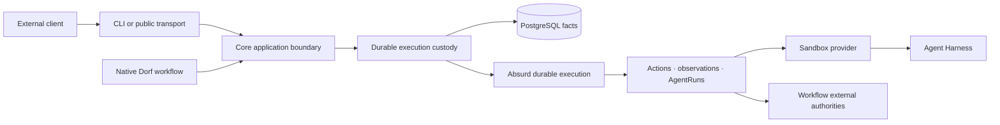

# Dorf Architecture

This document records Dorf's accepted Go, PostgreSQL, and Absurd boundaries. It defines authority,
recovery, composition, and evolution constraints. Code owns concrete package, schema, task, step,
query, and API shape; GitHub issues own temporary implementation scope and acceptance criteria.

Product direction and vocabulary live in the [North Star](north-star.md).

## System shape

Dorf runs as a stateful control-plane deployment. Native workflows call its application boundary
in-process. External clients call the same boundary through a supported transport, optionally using
a thin client SDK. They do not embed the control plane or its dependencies into their own process.

Absurd owns when durable work is eligible, claimed, checkpointed, retried, sleeping, waiting, or
cancelled. It does not own Dorf's product vocabulary or become the only place where a Job's truth can
be understood.

Layer ownership follows the [North Star product boundary](north-star.md#product-boundary). Its
technical consequence here is that the durable custody layer records stable Job and resource facts
and reconciles requested effects, while workflow/client policy enters only through explicit calls.
Adapters translate existing authorities; they do not invent another workflow.

## Authority model

| Fact | Authority |
| --- | --- |
| Job identity, bounded goal, accepted execution contract, durable lifecycle, and cleanup request/execution | Dorf-owned PostgreSQL facts |
| Workflow-specific facts and outcome | Workflow-owned PostgreSQL tables or typed records |
| Task claims, checkpoints, retry schedule, sleeps, waits, and cancellation | Absurd schema in the same PostgreSQL deployment |
| Agent transcript, tool items, Thread, Turn, and native history | The selected Harness |
| Mutable files, running processes, and local tool output | A Job-owned Sandbox |
| External objects and their mutable state | Their external authority, such as GitHub or another service |
| Named deliverables | Typed Artifact records whose bytes live in the content-addressed blob store |
| Retained observed proof | Evidence linked to the fact it proves; bytes use the same content-addressed blob store |

The same mutable fact must not be mirrored into multiple authorities. Read models may project facts
for inspection, but they are disposable and rebuildable. Agent prose and workflow reports are claims
or results; Evidence proves only what Dorf or an adapter actually observed.

Resource ownership follows lifetime. A Job is the aggregate owner of every Sandbox allocated for
it. A Sandbox owns or deterministically identifies its scoped provider route and injected authority.
AgentRuns use a Sandbox but never own it. Cleanup begins at the Job and reconciles resources against
their external authorities before declaring them removed, but only after a workflow or client has
requested resource release.

## Execution model

One admission creates one durable execution owner with complete bounded intent and a stable
idempotency identity. A workflow-driven Job also pins its workflow version. If recording and
scheduling cannot share one transaction, recovery reconciles the boundary rather than assuming both
happened.

A Job records an append-only ordered chain of Absurd task attachments. The latest attachment is its
current execution task; task names are observations, not hard-coded Job phases. A workflow may hand
off to another task without adding another task-ID column or changing retry semantics.

Each workflow has one readable coordinator over its natural facts. It asks what work is currently
missing, performs one bounded operation, records the resulting fact, reloads, and continues or waits.
Execution and human inspection derive from the same authoritative facts. Dorf does not persist a
second program counter merely to describe what those facts already imply.

The coordinator is ordinary Go, not a reusable graph interpreter. Absurd supplies durable tasks,
steps, events, retries, waits, claims, heartbeats, and cancellation. Dorf does not rebuild those
mechanics in product tables or query Absurd's private schema as workflow authority.

### Messages and AgentRuns

Accepted client input receives immutable Job-local identity and order. A follow preserves FIFO
order. A steer is an explicit priority intent targeting active work and must remain observable as
such. Wake events make work eligible; they do not replace durable delivery facts.

An AgentRun is one bounded delivery of one Message to an agent in a named Role and capability
envelope. It retains the exact Harness, Thread, Turn, submission, observation, and terminal facts
needed to reconcile uncertain delivery. Harness transcript and workspace details remain behind
their adapters. Retrying uncertain delivery reconciles the same AgentRun; it does not silently
create another judgment attempt.

Once an implementation Turn is durably bound as active, read-only harness observation is separate
from Message delivery. The workflow alternates observation with an interruptible durable wait, so
an accepted steer can wake and overtake polling without another controller path or duplicate Turn.

Thread reuse is a workflow choice. Coding may reuse an implementation Thread and isolate reviewers;
research may choose a different pattern. That choice does not create a second durable conversation
primitive.

### Deterministic operations

An Action is a code-owned external mutation with stable identity, intended scope, settlement state,
and a reconciliation path.
Before repeating an unsettled Action, Dorf inspects the actual authority. Immutable success makes an
identical retry a no-op.

Agent tool calls and agent-authored files are AgentRun work, not automatically Actions or Evidence.
A workflow observes relevant results at the AgentRun boundary and records natural typed facts.
Generic result strings, arbitrary metadata bags, and copied external state are not substitutes for
domain records.

### Artifacts, Evidence, and inspection

Artifacts are immutable named deliverables. A consumer-specific typed result may point to one or
more Artifacts, while clients discover them by Job and retrieve exact bytes by Artifact ID.
Artifact metadata is durable PostgreSQL state; bytes live in the deployment-owned content-addressed
blob store and survive Sandbox cleanup. Artifact content may contain claims and is not its own proof.

Evidence is immutable observed proof linked to the supported fact it proves, currently an AgentRun,
Action, or Revision. Its validity follows the claim it supports: a coding Revision change may
invalidate Revision-bound evidence, while a captured source or lifecycle observation may remain
valid.

Inspection projects one situation-first view from Dorf and workflow facts: accepted goal, observed
history, current work or attention, outcome, evidence, and cleanup. Raw Absurd attempts, leases,
checkpoints, and waits remain operator diagnostics through Absurd's tools rather than being copied
into Dorf's product history.

## Durable core and workflow facts

Core retains only execution facts whose authority and recovery meaning survive removal of client or
workflow policy: durable identity, accepted input order, AgentRuns, Sandbox ownership, stable
external effects, Artifact and Evidence custody, attention, recovery, and requested cleanup.

Client- and workflow-specific inputs, results, external authorities, and terminal meaning remain in
their typed owner. They do not become nullable Core fields, generic payloads, common phases, or
registries merely because Core stores or executes work on their behalf. Runtime composition grants
only the authorities required by that consumer; provider and Harness selection remain at the
composition boundary.

## Client boundary

Clients may drive bounded execution directly or delegate policy to a predefined workflow. Direct
clients decide what Messages to send, what results mean, whether more work is needed, and when to
request cleanup. Workflow clients delegate those decisions to the selected workflow. Both use the
same Core application contract and observe the same durable facts.

Native workflows call that contract in-process. External clients use a supported transport; a
language SDK is only a typed transport client for a running Dorf deployment. The CLI is the first
such adapter. A public network transport is earned by a real remote client rather than by exposing
PostgreSQL, Absurd, adapters, or an embeddable control-plane library.

CI, GitHub, webhooks, MCP, schedules, Slack, and user interfaces translate external events into
idempotent calls and render the same facts. They may own interaction and cross-Job composition
policy, but they are not hidden workflow engines inside Core.

## Native workflow composition

Native workflows consume the same application boundary without a privileged execution path. They
own typed input, sequencing, evaluation, external authorities, result meaning, and cleanup requests;
Core owns the reusable custody beneath those decisions. Their product and authoring direction lives
in the [North Star](north-star.md), while concrete behavior lives in code and its tests.

## Failure and code evolution

- **Process loss:** Absurd makes unfinished work eligible elsewhere; Dorf reconciles Actions and
  AgentRuns against their authorities before continuing.
- **Sandbox loss:** report the loss honestly. Replace it only when authoritative retained state makes
  continuity truthful.
- **External ambiguity:** inspect the external authority; never infer success from timeout or retry
  blindly.
- **Poison work:** bounded attempts, time, cost, and attention stop infinite agent or provider spend.
- **Operator retry:** after repairing the cause of the Job's latest attached execution task's
  terminal failure, `dorf retry JOB_ID` uses Absurd's public retry API to add exactly one bounded
  attempt to that same task. Existing checkpoints and Dorf facts remain authoritative; scheduling
  is not reported as successful resumption.
- **Code changes:** prefer short-lived Jobs, additive compatible task results where practical, and
  versioned workflow code. Let active Jobs drain on their pinned version rather than translating
  opaque execution history.

## Local, on-premise, and hosted shapes

The first product is local-first. PostgreSQL, Dorf executors, Incus, the Provider Gateway when used,
and agent services run on infrastructure controlled by the owner. The ordinary supported path
requires no Dorf-hosted durability account or host Docker socket.

"Infrastructure you control" may later include a local machine, bring-your-own-cloud or on-premise
execution, or a deliberately selected managed Sandbox provider. Support is expressed through
verified profiles, not a promise that every Harness works on every provider. Multi-tenant
authentication, billing, quotas, hosted secrets, and untrusted extension execution are separate
product requirements; they are not implied by choosing Absurd.

Deployment configuration owns host locations and credentials. Durable Jobs retain stable logical
connection and provider identities, not controller filesystem paths or copied secrets.

PostgreSQL owns each named Sandbox profile's provider, exact artifact, Harness, provider settings,
default selection, and Dorf functional-verification receipt. A Job pins the selected profile name.
The composition root resolves that durable name into one provider-neutral runtime bundle whenever
the Job runs or cleans up. Profiles are immutable while a referencing Job has incomplete cleanup;
an update clears verification and default status. Credentials remain host configuration.

## Harness and Sandbox adapters

Sandbox and Harness implementations meet provider-neutral custody contracts. Every external
operation carries exact Dorf ownership while provider locators, lifecycle APIs, command transports,
topology, and connection capabilities remain adapter-private. Consumer code selects a verified
profile rather than branching on provider or Harness identity.

A profile is not usable until Dorf's functional probe and exact proof-resource cleanup complete. A
provider/profile is not supported until its required route and Harness capabilities are admitted
and proved end to end. Current support claims belong in operator documentation, not this boundary.

Go remains the core. A language-specific executor is justified only when a concrete provider SDK or
workflow need makes that boundary materially smaller. It consumes a dedicated queue through a small
versioned contract and may not leak vendor types into core Job authority.

## Dependency budget

Use the Go standard library for ordinary HTTP/JSON, process control, hashing, configuration,
structured logging, concurrency, and tests. Prefer direct, programmatic boundaries to wrapper
frameworks whose model would become another authority to understand.

Absurd and the PostgreSQL driver surface are accepted core dependencies. One maintained WebSocket
implementation is acceptable for a Harness transport. Do not add an ORM, dependency-injection
container, web framework, message bus, migration framework, CLI framework, workflow DSL, or
observability distribution until a concrete terminal proves explicit code materially worse.

Every added module must name the real terminal it enables and remain removable behind a narrow
boundary. Transitive dependency count is a design signal, not a score to optimize at the expense of
correctness.

## Replacement and portability

- Do not build a Python compatibility facade, dual-write SQLite and PostgreSQL, or migrate old local
  data.
- Do not create a generic durable-engine interface. Keep Absurd sequencing localized and domain
  facts, deterministic policy, Actions, observations, and reconciliation independent.
- Use Absurd's public APIs for production behavior. Raw tables may support version-pinned tests or
  operator diagnostics but are not workflow authority.
- Preserve useful provisioning assets and observed behavior, not obsolete package or schema shape.
- Delete implementation and coupled tests after the replacing vertical slice reaches the same real
  terminal.

If Dorf outgrows Absurd, completed Jobs remain historical domain records, active short-lived Jobs can
drain, and new Jobs can begin on the replacement. Raw checkpoint history is not a portability
format.
