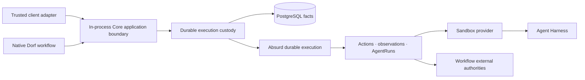

# Dorf Architecture

This document records Dorf's accepted Go, PostgreSQL, and Absurd boundaries. It defines authority,
recovery, composition, and evolution constraints. Code owns concrete package, schema, task, step,
query, and API shape; GitHub issues own temporary implementation scope and acceptance criteria.

Product direction and vocabulary live in the [North Star](north-star.md).

## System shape

Dorf runs as a stateful control-plane deployment. Native workflows and trusted client adapters are
composed into that deployment and call one small application boundary in-process. No public
transport, client SDK, or embeddable-runtime contract exists yet.

Absurd owns when durable work is eligible, claimed, checkpointed, retried, sleeping, waiting, or
cancelled. It does not own Dorf's product vocabulary or become the only place where a Job's truth can
be understood.

Layer ownership follows the [North Star product boundary](north-star.md#product-boundary). Its
technical consequence here is that the durable custody layer records stable Job and resource facts
and reconciles requested effects, while workflow/client policy enters only through explicit calls.
Adapters translate existing authorities; they do not invent another workflow.

## Authority model

| Fact | Authority |
| --- | --- |
| Job identity, bounded goal, accepted execution contract, durable lifecycle, and cleanup request/execution | Dorf-owned PostgreSQL facts |
| Workflow-specific facts and outcome | Workflow-owned PostgreSQL tables or typed records |
| Task claims, checkpoints, retry schedule, sleeps, waits, and cancellation | Absurd schema in the same PostgreSQL deployment |
| Agent transcript, tool items, Thread, Turn, and native history | The selected Harness |
| Mutable files, running processes, and local tool output | A Job-owned Sandbox |
| External objects and their mutable state | Their external authority, such as GitHub or another service |
| Retained observed proof | Evidence linked to the fact it proves; bytes use the same content-addressed blob store |

The same mutable fact must not be mirrored into multiple authorities. Read models may project facts
for inspection, but they are disposable and rebuildable. Agent prose and workflow reports are claims
or results; Evidence proves only what Dorf or an adapter actually observed.

Resource ownership follows lifetime. A Job is the aggregate owner of every Sandbox allocated for
it. A Sandbox owns or deterministically identifies its
scoped provider route and injected authority. AgentRuns use a Sandbox but never own it; they remain
internal durable recovery facts rather than caller-coordinated resources. Cleanup begins at the Job
and reconciles resources against their external authorities before declaring them removed, but only
after a workflow, composed module, or client has requested resource release. Core never infers that
request from success, failure, an Outcome, inactivity, or a need for human input.

## Execution model

One admission creates one durable execution owner with complete bounded intent and a stable
idempotency identity. A workflow-driven Job also pins its workflow version. If recording and
scheduling cannot share one transaction, recovery reconciles the boundary rather than assuming both
happened.

A Job records an append-only ordered chain of Absurd task attachments. The latest attachment is its
current execution task; task names are observations, not hard-coded Job phases. A workflow may hand
off to another task without adding another task-ID column or changing retry semantics.

Each workflow has one readable coordinator over its natural facts. It asks what work is currently
missing, performs one bounded operation, records the resulting fact, reloads, and continues, stops
for attention or completion, or returns no current operation. An open Job with no eligible operation
keeps its current attached task in an Absurd wait; idleness is not a workflow operation or persisted
status. Execution and human inspection derive from the same authoritative facts. Dorf does not
persist a second program counter merely to describe what those facts already imply.

The coordinator is ordinary Go, not a reusable graph interpreter. Absurd supplies durable tasks,
steps, events, retries, waits, claims, heartbeats, and cancellation. Dorf does not rebuild those
mechanics in product tables or query Absurd's private schema as workflow authority.

The in-process application contract follows the ownership hierarchy. Admitting complete Core intent
returns the Job handle. `EnsureSandbox` returns that Job's Sandbox handle. A Sandbox exposes an Agent
convenience handle for bounded agent work. Behind that handle Core selects the Harness and durably
creates and reconciles the Message and AgentRun facts; consumers do not coordinate Harness, Message,
or AgentRun lifecycle themselves. Provider and Harness interfaces remain internal adapter seams
rather than alternate application contracts.

### Messages and AgentRuns

Accepted client input receives immutable Job-local identity and order. A caller-retained per-send
idempotency key binds its complete admitted delivery request: the exact Sandbox, text, follow or
steer intent and target, authorized Role, capability and input Revision when used, and the caller's
Thread reuse choice. The same key and request return the same Message; changing any bound field
conflicts; a different key may admit identical text. Sending through the Agent handle defaults to
follow, which preserves FIFO order. Steer is a distinct explicit mode targeting active work and
remains observable as such. Wake events make work eligible; they do not replace durable delivery
facts. A later Message wakes the Job's existing execution task rather than attaching a task for that
Message. A bounded reload of durable Message facts covers a missing wake hint, and an executor
restart reclaims the same task attachment.

An AgentRun is Core's internal durable recovery fact for one bounded delivery of one Message to an
agent in a named Role and capability envelope. It retains the exact Harness, Thread, Turn,
submission, observation, and terminal facts needed to reconcile uncertain delivery. Harness
transcript and workspace details remain behind their adapters. Retrying uncertain delivery
reconciles the same AgentRun; it does not silently create another judgment attempt.

An Agent handle is bound to one exact Job-owned Sandbox. Submission, history reconciliation, wait,
and steer through that handle cannot fall back to another Sandbox in the Job.

Once a Turn is durably bound as active, Core's read-only Harness observation remains separate from
Message delivery. Internal delivery reconciliation alternates observation with an interruptible
durable wait, so an accepted steer can wake and overtake polling without another controller path or
duplicate Turn.

Thread reuse is a workflow choice. Coding may reuse an implementation Thread and isolate reviewers;
research may choose a different pattern. That choice does not create a second durable conversation
primitive.

### Deterministic operations

An Action is a code-owned external mutation with stable identity, intended scope, settlement state,
and a reconciliation path.
Before repeating an unsettled Action, Dorf inspects the actual authority. Immutable success makes an
identical retry a no-op.

Agent tool calls and agent-authored files are AgentRun work, not automatically Actions or Evidence.
Core exposes settled agent work through the Agent application handle; a workflow observes its
relevant domain results and records natural typed facts. Generic result strings, arbitrary metadata
bags, and copied external state are not substitutes for domain records.

### Workspace files, Evidence, and inspection

`SandboxHandle.ReadFile` returns the exact bytes of one caller-named, clean workspace-relative
regular file from that exact Job-owned Sandbox. Core checks Job and Sandbox ownership, executes the
read under the Job cleanup fence, and rejects traversal, symlinks, and resolved paths outside the
workspace. It does not add listing, discovery, stat, glob, archive, batch, or directory-download
APIs; a workflow that needs discovery may compose the existing Sandbox command operation before
requesting exact files. Core does not interpret, discover, or retain agent-authored files. A caller
or workflow must read any files it needs before requesting cleanup; the request closes reads and
Sandbox deletion makes those files unavailable. The current operation returns the whole file in
memory without an invented size policy; a streaming contract remains unearned. Durable typed
results remain owned by the workflow that understands them.

Evidence is immutable observed proof linked to the supported fact it proves, currently an AgentRun,
Action, or Revision. Its validity follows the claim it supports: a coding Revision change may
invalidate Revision-bound evidence, while a captured source or lifecycle observation may remain
valid.

Inspection projects one situation-first view from Dorf and workflow facts: accepted goal, observed
history, current work or attention, outcome, evidence, and cleanup. Raw Absurd attempts, leases,
checkpoints, and waits remain operator diagnostics through Absurd's tools rather than being copied
into Dorf's product history.

## Durable core and workflow facts

Core retains only execution facts whose authority and recovery meaning survive removal of client or
workflow policy: durable identity, accepted input order, internal AgentRuns, Sandbox ownership,
stable external effects, Evidence custody, recovery, caller-requested
attention, and caller-requested cleanup.

Client- and workflow-specific inputs, results, external authorities, and terminal meaning remain in
their typed owner. They do not become nullable Core fields, generic payloads, common phases, or
registries merely because Core stores or executes work on their behalf. Runtime composition grants
only the authorities required by that consumer; provider and Harness selection remain at the
composition boundary.

## Client boundary

Trusted client adapters may drive bounded execution directly or delegate policy to a predefined
workflow. Direct clients decide what agent work to request, what results mean, whether more work is
needed, and when to request cleanup. Workflow clients delegate those decisions to the selected
workflow. Both compose the same in-process Core application contract and observe the same durable
facts.

The CLI is one composed client adapter. A public transport, authentication contract, language SDK,
plugin system, or workflow DSL must be earned by a real external consumer; none is part of the
current boundary. Future adapters may translate external events into idempotent application calls
and render the same facts, but they must not expose PostgreSQL, Absurd, provider adapters, or Core as
an embeddable runtime.

## Native workflow composition

Native workflows consume the same application boundary without a privileged execution path. They
own typed input, sequencing, evaluation, external authorities, result meaning, and cleanup requests;
Core owns the reusable custody beneath those decisions. Their product and authoring direction lives
in the [North Star](north-star.md), while concrete behavior lives in code and its tests.

Git, coding, GitHub, publication, and human-in-the-loop behavior are workflow/module/client policy.
They may use the Sandbox and Agent handles but are not Core capabilities or provider behavior.

Reusable external-authority integrations are deployment modules composed beside Core. The GitHub
integration uses a static, backend-free launcher for GitHub's POST-only App Manifest flow and retains
the returned protected credential bundle only after verifying the App identity and exact supported
permission envelope. Runtime operations discover their exact repository installation, verify any
repository or base authority they need, and mint short-lived repository-scoped tokens with the least
required subset of the App's admitted permissions. A selected profile's coding runtime composes that
deployment integration; the durable profile definition stores no GitHub credentials or scope, and
Job requests do not repeat them. Core knows nothing about GitHub. Plain Git access, including public
clones and retained Git input, does not require the integration.

## Failure and code evolution

- **Process loss:** Absurd makes unfinished work eligible elsewhere; Dorf reconciles Actions and
  AgentRuns against their authorities before continuing.
- **Sandbox loss:** report the loss honestly. Replace it only when authoritative retained state makes
  continuity truthful.
- **External ambiguity:** inspect the external authority; never infer success from timeout or retry
  blindly.
- **Poison work:** bounded attempts, time, cost, and attention stop infinite agent or provider spend.
- **Operator retry:** after repairing the cause of the Job's latest attached execution task's
  terminal failure, `dorf retry JOB_ID` uses Absurd's public retry API to add exactly one bounded
  attempt to that same task. Existing checkpoints and Dorf facts remain authoritative; scheduling
  is not reported as successful resumption.
- **Code changes:** prefer short-lived Jobs, additive compatible task results where practical, and
  versioned workflow code. Let active Jobs drain on their pinned version rather than translating
  opaque execution history.

## Local, on-premise, and hosted shapes

The first product is local-first. PostgreSQL, Dorf executors, Incus, the Provider Gateway when used,
and agent services run on infrastructure controlled by the owner. The ordinary supported path
requires no Dorf-hosted durability account or host Docker socket.

"Infrastructure you control" may later include a local machine, bring-your-own-cloud or on-premise
execution, or a deliberately selected managed Sandbox provider. Support is expressed through
verified profiles, not a promise that every Harness works on every provider. Multi-tenant
authentication, billing, quotas, hosted secrets, and untrusted extension execution are separate
product requirements; they are not implied by choosing Absurd.

Deployment configuration owns host locations and credentials. Durable Jobs retain stable logical
connection and provider identities, not controller filesystem paths or copied secrets.

PostgreSQL owns each named Sandbox profile's provider, exact artifact, Harness, provider settings,
default selection, and Dorf functional-verification receipt. A Job pins the selected profile name.
The composition root resolves that durable name into one provider-neutral runtime bundle whenever
the Job runs or cleans up. A current successful receipt gates default selection and new admission;
it is not a runtime lease for already-admitted Jobs. Explicit re-verification may replace that
receipt while Jobs continue against the unchanged definition, fencing new admission until the new
attempt settles successfully. Profiles are immutable while a referencing Job has incomplete
cleanup; an update clears verification and default status. Credentials remain host configuration.

### Current dogfood deployment terminals

The local workstation terminal runs Dorf, PostgreSQL, the Worker, Incus/KVM Sandboxes, and a private
Provider Gateway on one owner-controlled machine. It requires no cloud controller, public Gateway
hostname, or tunnel.

The cloud controller terminal runs Dorf, PostgreSQL, the Worker, and a loopback-bound Provider
Gateway on an ordinary shared Linux VM without Incus or KVM. Managed E2B Sandboxes reach only the
scoped Gateway through a stable deployment-owned outbound HTTPS tunnel; administration and storage
remain private.

Live proof selects the terminal that exercises the changed authority. Local Incus, image, KVM, or
private-network changes require the workstation terminal. E2B, remote Gateway, and cloud
self-hosting changes require the cloud-controller terminal. Provider-neutral lifecycle, setup,
profile, or portability changes that claim to serve both require both fresh terminals. Other Core
and workflow slices require one real end-to-end terminal on the relevant target, not both by
default. Host requirements derive from the selected Sandbox profiles; Incus and KVM are not
universal Dorf prerequisites.

## Harness and Sandbox adapters

Sandbox and Harness implementations meet provider-neutral custody contracts. Every external
operation carries exact Dorf ownership while provider locators, lifecycle APIs, command transports,
topology, and connection capabilities remain adapter-private. Consumer code selects a verified
profile rather than branching on provider or Harness identity.

A profile is not usable until Dorf's functional probe and exact proof-resource cleanup complete. A
provider/profile is not supported until its required route and Harness capabilities are admitted
and proved end to end. Current support claims belong in operator documentation, not this boundary.

Go remains the core. A language-specific executor is justified only when a concrete provider SDK or
workflow need makes that boundary materially smaller. It consumes a dedicated queue through a small
versioned contract and may not leak vendor types into core Job authority.

## Dependency budget

Use the Go standard library for ordinary HTTP/JSON, process control, hashing, configuration,
structured logging, concurrency, and tests. Prefer direct, programmatic boundaries to wrapper
frameworks whose model would become another authority to understand.

Absurd and the PostgreSQL driver surface are accepted core dependencies. One maintained WebSocket
implementation is acceptable for a Harness transport. Do not add an ORM, dependency-injection
container, web framework, message bus, migration framework, CLI framework, workflow DSL, or
observability distribution until a concrete terminal proves explicit code materially worse.

Every added module must name the real terminal it enables and remain removable behind a narrow
boundary. Transitive dependency count is a design signal, not a score to optimize at the expense of
correctness.

## Replacement and portability

- Do not build a Python compatibility facade, dual-write SQLite and PostgreSQL, or migrate old local
  data.
- Do not create a generic durable-engine interface. Keep Absurd sequencing localized and domain
  facts, deterministic policy, Actions, observations, and reconciliation independent.
- Use Absurd's public APIs for production behavior. Raw tables may support version-pinned tests or
  operator diagnostics but are not workflow authority.
- Preserve useful provisioning assets and observed behavior, not obsolete package or schema shape.
- Delete implementation and coupled tests after the replacing vertical slice reaches the same real
  terminal.

If Dorf outgrows Absurd, completed Jobs remain historical domain records, active short-lived Jobs can
drain, and new Jobs can begin on the replacement. Raw checkpoint history is not a portability
format.
