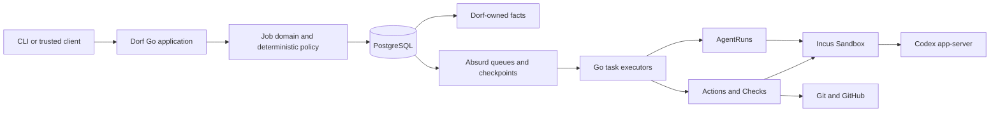

# Greenfield Architecture — Go + Absurd

This document records the accepted architecture direction for replacing Dorf's current Python
implementation. It defines durable boundaries and engineering constraints. GitHub issues own the
implementation sequence, acceptance criteria, and live execution ledger; code owns concrete package
and API shape.

During the cutover, the Python implementation is evidence about observed behavior, not a
compatibility target. There are no users or durable installations to migrate. Old local state,
SQLite schemas, Python APIs, CLI shapes, and document formats may be discarded.

## System shape

The core is a Go application using Absurd on PostgreSQL for durable execution. Incus is the first
Sandbox provider, Codex app-server is the first agent Harness, and GitHub remains authoritative for
the proposed coding deliverable.

Absurd owns when durable work is eligible, claimed, checkpointed, retried, sleeping, or waiting for
an event. It does not own Dorf's product vocabulary or become the only place where a Job's truth can
be understood.

## Durable authority

| Fact | Authority |
| --- | --- |
| Job goal, lifecycle, current Revision, inbox order, selected ReviewPlan, AgentRun inputs/state and exact Harness/Thread/Turn binding, and terminal outcome | Dorf-owned PostgreSQL tables |
| Task claims, runs, checkpoints, retry schedule, sleeps, and wake events | Absurd schema in the same PostgreSQL deployment |
| Agent transcript, harness tool items, and Thread and Turn history | The selected agent Harness |
| Mutable checkout, running processes, and local build output | A Job-owned Sandbox |
| Branch, commits, pull request, review state, and merge result | Git and GitHub |
| Retained proof | Content-addressed Evidence referenced by Dorf records and pinned to a Revision |

The same mutable fact must not be mirrored into multiple authorities. Read models may project these
facts for inspection, but they are disposable and rebuildable.

Resource ownership follows lifetime. A Job is the aggregate and lifetime owner of one or more
Sandboxes. Each Sandbox owns its scoped Provider Route. AgentRuns use a Sandbox and retain the
binding they used; they do not own infrastructure. Cleanup starts at the Job and walks its
Sandboxes, revoking each Route before deleting its Sandbox. There is no polymorphic owner kind/id.

## Execution model

One admitted coding request creates one Job with a complete goal and stable identity. The Job's
durable task sequences explicit, named phases; it does not contain a generic user-programmable DAG.

- Admission records the complete goal before agent work begins and schedules the Job with a stable
  idempotency identity. If recording and scheduling cannot be made one transaction, recovery
  reconciles the two facts rather than assuming both happened.
- Deterministic coding sequencing is one explicit `workflow.RunJob` coordinator. It reads the
  product facts in order: Sandbox, clone, setup, route, AgentRun delivery, Revision observation,
  Checks, selected review, exact-Revision push and proposal, then proposal observation. Each
  repeatable operation uses a
  public Absurd Step with a stable name derived from its Action, AgentRun, Revision, or Check ID and
  a small typed result. Absurd owns step, retry, lease, heartbeat, wait, and cancellation mechanics;
  Dorf keeps only product facts and Action receipts. The spine exposes single operations to this
  coordinator; it does not own the whole coding loop or hold a long Job fence across external work.
  `workflow_phase` remains a transitional domain guard until Slice 8; no second service-layer
  coordinator or publication task interprets it. Publication is two direct main-task Steps backed by
  stable Actions. Absurd's public retry resumes that task after an operator resolves attention.
- Judgment executes as an AgentRun consuming an exact durable Message, with a bounded Role, input
  Revision, capability envelope, Harness, Thread, Turn, and Turn outcome. The Message is its only
  durable text input. Evidence retained for a harness observation links directly to that AgentRun.
  The Sandbox workspace and harness protocol are adapter inputs, not durable AgentRun fields.
- Implementation AgentRuns create one or many commits when they change code. On completion, Dorf
  validates a clean checkout. A descendant `HEAD` becomes the next exact Revision; unchanged `HEAD`
  records that the Message was handled without a code change.
- Thread reuse is a workflow choice, not a distinct core or storage primitive. The current
  implementation flow reuses the Thread bound to a prior implementation AgentRun; current reviewers
  use isolated one-shot Threads. Another Role may later reuse a prior Thread without changing
  AgentRun storage. Every AgentRun consumes one Message, and every Message selected for agent delivery
  has one AgentRun record. A follow normally submits a new Turn; a steer normally binds to its target
  Turn and submits a new Turn only on terminal-target fallback. Absurd retry reconciles the same
  delivery and is not a new AgentRun.
- Accepted client messages receive an immutable Job-local sequence and identity. Follow-up Turns
  preserve FIFO order. A `steer` is an explicit priority lane targeting the active harness Turn, so
  it may overtake already queued follow-ups. Default text and structured inspection, command help,
  and admission acknowledgement expose the priority behavior, original admission sequence, and
  targeted turn so it is never presented as ordinary FIFO delivery. A wake event only makes work
  eligible, and delivery is reconciled against the exact Harness/Thread/Turn identity before retry.
- A changed Revision invalidates Evidence whose claim depended on the previous Revision. It does not
  invalidate unrelated immutable facts.
- After publication, the same Job task observes the exact pull request. An owner or collaborator
  comment becomes an idempotent human Message and re-enters the implementation AgentRun path. The
  GitHub edge reconciles one eyes reaction and one exact-Revision completion reply without adding core
  state. Merge records an accepted Outcome; close without merge records a rejected Outcome. A bounded
  wait keeps quiet observation durable without adding a Dorf polling scheduler or GitHub-state mirror.

## Deterministic effects

Every code-owned external mutation receives a stable Action identity derived from the Job, its
intended meaning, and the exact Sandbox it targets when applicable. Ordinary Sandbox creation,
clone, route, review-checkout, and cleanup mutations all use that one Sandbox-scoped path. Setup
retains its generation-aware path, while publication retains its exact-Revision path. Dorf records
enough information to classify the Action as
pending, succeeded, failed, or uncertain. On an uncertain result, recovery inspects the external
authority before repeating the operation. Agent tool calls and commits are AgentRun work, not
Actions; so is submission and recovery of the harness Turn that the AgentRun itself records. Dorf
observes the Turn and resulting Git state at the AgentRun boundary.

Action success is immutable: the first reconciled result is recorded, an identical retry is a
no-op, and a conflicting later result is rejected. An Absurd Step checkpoints execution; it does
not replace the Action's external-settlement fact.

Actions apply at least to Sandbox creation and destruction, repository clone and push, scoped
credential or provider-route creation, and pull-request publication. Agent execution has one
durable record instead: AgentRun. Absurd
checkpoints prevent completed logical steps from normally repeating; Action reconciliation handles
the unavoidable boundary where an external system succeeds and its response is lost.

## Review composition

Review is selected, not ritualized. A pure Go `ReviewPolicy(ChangeFacts) -> ReviewPlan` selects
known specialist Roles through explicit rules. An unknown classification selects one bounded
general reviewer rather than a triage router. There is no general Coordinator Agent because the
durable Job already coordinates mechanics.

Each selected Role is an AgentRun against an immutable Revision in its own disposable Sandbox and
scoped provider route. This deliberately uniform isolation model also applies to read-only review.
ReviewPolicy creates one stable workflow Message containing the selected Role's input; the review
AgentRun consumes that Message through the same durable relationship as any other AgentRun. Later
reviewer follow-up may therefore reuse its Thread without a new storage primitive.
Independent Roles may run in parallel, and each Role's live resources are reclaimed after its output
is retained. Reviewer output remains ordinary text. Dorf copies it into a Message to the
implementation AgentRun path instead of parsing a `ReviewResult`, persisting a `Finding`, or
copying the prose into Evidence. One observed Evidence record proves the completed AgentRun's
Harness/Thread/Turn binding and Turn outcome.
The implementation agent decides whether to act, ignore, or explain. If it commits, Dorf observes
a new Revision and repeats Checks and policy; if it leaves a clean unchanged checkout, review is
complete for that Revision.

## Failure and code evolution

- **Process loss:** Absurd leases and checkpoints make the Job eligible for another task executor. Dorf
  reconciles unsettled Actions and AgentRuns against their respective external authorities before
  continuing.
- **Sandbox loss:** Report the loss honestly. Replace it only when authoritative Git state and a
  resumable or intentionally fresh Thread make the resulting continuity truthful.
- **External ambiguity:** Inspect the Action receipt and external authority; never infer success
  from a timeout and never retry blindly.
- **Code changes:** Prefer short-lived Jobs. Make additive checkpoint-result changes when possible;
  version task or step names when meaning changes. Let old Jobs drain on old executors rather than
  translating execution history.
- **Poison work:** Terminal errors and bounded retry policies stop infinite model or provider spend.

## Local and hosted shapes

The first product is local-first. PostgreSQL, Dorf task executors, Incus, the Provider Gateway when used,
and agent services run on infrastructure controlled by the owner. The ordinary path requires no
hosted durability account or API key. Setup must make PostgreSQL prerequisites and diagnostics
explicit rather than hiding Docker or a cloud dependency.

Deployment configuration owns the Provider Gateway storage location. Setup, doctor, admission, and
task executors resolve the same location; a durable Job retains only the selected Provider Connection
name and never a host filesystem locator.

A small hosted deployment uses the same Job and executor protocol with a managed or self-operated
PostgreSQL service and private executor connectivity. Multi-tenant authentication, quotas, billing,
and untrusted extension hosting are separate product requirements and are not implied by choosing
Absurd.

## Polyglot edge

Go remains the core. A language-specific executor is justified only when a concrete SDK creates a
material advantage, such as a TypeScript E2B integration or Python Daytona integration. Such a
executor pulls from a dedicated Absurd queue and exchanges a small, versioned JSON contract. It may
not leak vendor types into Job, Evidence, policy, or terminal state.

Do not add a plugin registry, provider matrix, generated RPC layer, or second language in
anticipation of a hypothetical integration.

## Dependency budget

Use the Go standard library for HTTP and JSON boundaries, process and signal control, hashing,
configuration, structured logging, concurrency, and tests. Prefer the existing `incus` and `git`
programmatic command surfaces and direct GitHub HTTP APIs over wrapper frameworks whose extra model
would become another authority to understand.

The accepted core third-party dependency is Absurd plus the PostgreSQL driver surface required to
use it and store Dorf facts. One small maintained WebSocket implementation is acceptable if Codex
app-server's transport requires it. Do not add an ORM, dependency-injection container, web framework,
message bus, migration framework, CLI framework, or observability distribution until a concrete
slice proves that explicit standard-library code is materially worse.

Every added module must name the real terminal it enables and be removable behind a narrow boundary.
Review the final module graph at cutover; transitive dependency count is a design signal, not a
score to optimize at the expense of correctness.

## Replacement and portability

- Do not build a Python compatibility facade, dual-write SQLite and PostgreSQL, or migrate old
  local data.
- Do not create a generic durable-engine interface. Keep Absurd-specific sequencing localized and
  keep domain facts, deterministic policy, Actions, Checks, and external reconciliation independent.
- Use Absurd's public task, step, event, cancellation, and inspection APIs for production behavior.
  Raw Absurd tables may support version-pinned white-box tests or operator tooling, but must not be
  Dorf's workflow authority. Do not recreate its generic retry, checkpoint, lease, or recovery
  machinery in Dorf-owned schema.
- Preserve useful provisioning assets and observed behavior, not old module boundaries.
- Delete a Python component and its implementation-coupled tests after the Go path has reached the
  corresponding real terminal.

If Dorf ever outgrows Absurd, completed Jobs remain historical domain records, active short-lived
Jobs can drain, and a replacement engine can start new Jobs from Dorf-owned facts. Raw Absurd
checkpoint history is not a portability format.

## Greenfield cutover terminal

The replacement is ready to become `main` when a clean machine can complete one real coding Job:

1. converge local setup without a cloud account or host Docker socket;
2. admit a complete goal and create one isolated Sandbox and branch;
3. start a real implementation AgentRun and accept steering while it is active;
4. survive controller and task-executor loss without duplicating a Sandbox, message, turn, or external
   Action;
5. run deterministic repository Checks and retain Revision-pinned Evidence;
6. select any review through deterministic policy and return its text as a Message to the same
   implementation AgentRun path;
7. publish an exact-Revision pull-request proposal;
8. reach an explicit accepted, rejected, or abandoned outcome; and
9. reconcile cleanup to an observable terminal.

The terminal must run without Python in the critical path. Feature parity with the deleted Python
implementation is not required.
