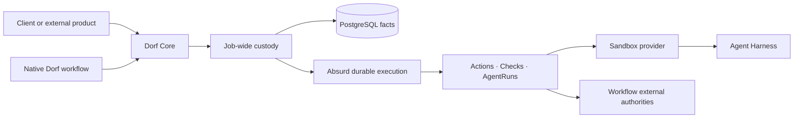

# Greenfield Architecture — Go + Absurd

This document records Dorf's accepted Go, PostgreSQL, and Absurd boundaries. It defines authority,
recovery, composition, and evolution constraints. Code owns concrete package, schema, task, step,
query, and API shape; GitHub issues own temporary implementation scope and acceptance criteria.

The superseded Python implementation is historical evidence, not a compatibility target. Old local
state, SQLite schemas, Python APIs, CLI shapes, and document formats are not supported.

## Product and implementation scope

Product direction and vocabulary live in the [North Star](north-star.md).

The verified implementation is deliberately narrow: one Go application, two explicit workflows,
PostgreSQL, Absurd, named Incus or E2B Sandbox profiles, Codex and Pi, Git, and GitHub. The
`codebase-investigation` workflow has an independent coordinator, retained drafts, an exact human
decision boundary, and a live Incus dogfood terminal. This
architecture must keep both concrete paths clear without treating coding-specific or investigation-
specific records as the permanent public workflow API.

## System shape

Absurd owns when durable work is eligible, claimed, checkpointed, retried, sleeping, waiting, or
cancelled. It does not own Dorf's product vocabulary or become the only place where a Job's truth can
be understood.

Layer ownership follows the [North Star product boundary](north-star.md#product-boundary). Its
technical consequence here is that the durable custody layer records stable Job and resource facts
and reconciles requested effects, while workflow/client policy enters only through explicit calls.
Adapters translate existing authorities; they do not invent another workflow.

## Authority model

| Fact | Authority |
| --- | --- |
| Job identity, bounded goal, workflow identity/version, accepted input, durable lifecycle, and cleanup request/execution | Dorf-owned PostgreSQL facts |
| Workflow-specific facts and outcome | Workflow-owned PostgreSQL tables or typed records |
| Task claims, checkpoints, retry schedule, sleeps, waits, and cancellation | Absurd schema in the same PostgreSQL deployment |
| Agent transcript, tool items, Thread, Turn, and native history | The selected Harness |
| Mutable files, running processes, and local tool output | A Job-owned Sandbox |
| External objects and their mutable state | Their external authority, such as GitHub or another service |
| Named workflow deliverables | Typed Artifact records whose bytes live in the content-addressed blob store |
| Retained observed proof | Evidence linked to the fact it proves; bytes use the same content-addressed blob store |

The same mutable fact must not be mirrored into multiple authorities. Read models may project facts
for inspection, but they are disposable and rebuildable. Agent prose and workflow reports are claims
or results; Evidence proves only what Dorf or an adapter actually observed.

Resource ownership follows lifetime. A Job is the aggregate owner of every Sandbox allocated for
it. A Sandbox owns or deterministically identifies its scoped provider route and injected authority.
AgentRuns use a Sandbox but never own it. Cleanup begins at the Job and reconciles resources against
their external authorities before declaring them removed, but only after a workflow or client has
requested resource release.

## Execution model

One admission creates one Job with complete bounded intent, a stable idempotency identity, and one
pinned workflow version. If recording and scheduling cannot share one transaction, recovery
reconciles the boundary rather than assuming both happened.

A Job records an append-only ordered chain of Absurd task attachments. The latest attachment is its
current execution task; task names are observations, not hard-coded Job phases. A workflow may hand
off to another task without adding another task-ID column or changing retry semantics.

Each workflow has one readable coordinator over its natural facts. It asks what work is currently
missing, performs one bounded operation, records the resulting fact, reloads, and continues or waits.
Execution and human inspection derive from the same authoritative facts. Dorf does not persist a
second program counter merely to describe what those facts already imply.

The coordinator is ordinary Go, not a reusable graph interpreter. Absurd supplies durable tasks,
steps, events, retries, waits, claims, heartbeats, and cancellation. Dorf does not rebuild those
mechanics in product tables or query Absurd's private schema as workflow authority.

### Messages and AgentRuns

Accepted client input receives immutable Job-local identity and order. A follow preserves FIFO
order. A steer is an explicit priority intent targeting active work and must remain observable as
such. Wake events make work eligible; they do not replace durable delivery facts.

An AgentRun is one bounded delivery of one Message to an agent in a named Role and capability
envelope. It retains the exact Harness, Thread, Turn, submission, observation, and terminal facts
needed to reconcile uncertain delivery. Harness transcript and workspace details remain behind
their adapters. Retrying uncertain delivery reconciles the same AgentRun; it does not silently
create another judgment attempt.

Once an implementation Turn is durably bound as active, read-only harness observation is separate
from Message delivery. The workflow alternates observation with an interruptible durable wait, so
an accepted steer can wake and overtake polling without another controller path or duplicate Turn.

Thread reuse is a workflow choice. Coding may reuse an implementation Thread and isolate reviewers;
research may choose a different pattern. That choice does not create a second durable conversation
primitive.

### Deterministic operations

A Check observes or asserts without mutating an external authority. An Action is a code-owned
external mutation with stable identity, intended scope, settlement state, and a reconciliation path.
Before repeating an unsettled Action, Dorf inspects the actual authority. Immutable success makes an
identical retry a no-op.

Agent tool calls and agent-authored files are AgentRun work, not automatically Actions or Evidence.
A workflow observes relevant results at the AgentRun boundary and records natural typed facts.
Generic result strings, arbitrary metadata bags, and copied external state are not substitutes for
domain records.

### Artifacts, Evidence, and inspection

Artifacts are immutable named workflow deliverables. A workflow-specific typed result may point to
one or more Artifacts, while clients discover them by Job and retrieve exact bytes by Artifact ID.
Artifact metadata is durable PostgreSQL state; bytes live in the deployment-owned content-addressed
blob store and survive Sandbox cleanup. Artifact content may contain claims and is not its own proof.

Evidence is immutable observed proof linked to the supported fact it proves, currently an AgentRun,
Action, Check, or Revision. Its validity follows the claim it supports: a coding Revision change may
invalidate Revision-bound evidence, while a captured source or lifecycle observation may remain
valid.

Inspection projects one situation-first view from Dorf and workflow facts: accepted goal, observed
history, current work or attention, outcome, evidence, and cleanup. Raw Absurd attempts, leases,
checkpoints, and waits remain operator diagnostics through Absurd's tools rather than being copied
into Dorf's product history.

## Durable core and workflow facts

The intended reusable custody concepts are Job identity, admission, Messages, AgentRuns, Sandbox
ownership, stable external effects, Artifact and Evidence storage, attention, recovery, and cleanup.
Their exact public shape is not yet accepted.

The current implementation still places repository, branch, Revision, review, Proposal, and GitHub
assumptions in records near the spine. That is evidence from the first workflow, not a reason to make
every field nullable or introduce generic payload tables. A second workflow should first add its
natural facts and coordinator. Only duplicated behavior with the same authority and recovery meaning
earns extraction.

Workflow facts remain specific:

- coding owns repository authority, Revisions, Checks tied to a Revision, review policy, Proposal,
  GitHub outcome, and coding inspection;
- codebase investigation owns its exact repository input, flexible Markdown drafts, exact human
  disposition, and post-Turn unchanged-checkout assertion; and
- future workflows must not inherit Git or research semantics merely to reuse durable custody.

Do not introduce a polymorphic fact owner, generic JSON result, arbitrary Action registry, or common
workflow phase to make unlike facts look similar.

## Client boundary

Clients submit bounded intent, inspect, send Messages, receive results, and request explicit terminal
operations. They do not open PostgreSQL, drive Absurd, construct adapters, or become workflow
authorities.

The CLI with stable structured output is the first client boundary and the smallest integration for
a same-host orchestrator such as Agent0. A thin language SDK may wrap the proven application
contract. HTTP is justified when a real remote or untrusted client needs it. CI, GitHub, webhooks,
MCP, schedules, Slack, and user interfaces are adapters that translate events into idempotent Job
admission and render the same facts; they are not separate workflow engines.

## Native workflow composition

Native workflows must use the same application boundary as other clients rather than a privileged
internal path. Their product and authoring direction lives in the [North Star](north-star.md).

## Current coding composition

One admitted coding request owns its Sandboxes, clone, branch, Revision line, implementation Thread,
selected review resources, exact pull-request Proposal, explicit outcome, and cleanup. Its explicit
coordinator orders deterministic setup, implementation AgentRuns, Git observation, repository
Checks, selected review, publication, feedback, terminal observation, and cleanup from natural
facts.

Review is selected rather than ritualized. Deterministic policy supplies mandatory review for known
risks and may select one bounded general reviewer for unknown work. Each reviewer consumes a
workflow Message in an isolated capability envelope. Reviewer prose returns as a Message to the
implementation path; it is not parsed into a universal policy result or copied into Evidence.

Git and GitHub remain authoritative for branch, commits, pull request, comments, merge, and close.
Exact external observations produce the coding outcome. Explicit abandonment is human authority and
may occur before a Proposal. Outcome and cleanup remain separate.

## Current codebase-investigation composition

One admitted investigation pins an exact repository source and Revision, unstructured brief,
workflow revision, Sandbox profile, and model envelope. A source is either a reachable remote Git
repository or a content-addressed Git bundle retained before admission; retained inputs are not
workflow-output Artifacts. Its explicit coordinator creates one Job-owned Sandbox, materializes the
exact Revision through the provider-neutral file boundary when required, installs the scoped
Provider Route, and runs one bounded `investigate` AgentRun per accepted Message. Every completed
Turn must leave the checkout exact and clean before its Markdown becomes an immutable numbered draft
Artifact. The coordinator then waits durably: a follow-up Message creates another AgentRun in the
same Harness Thread and Sandbox. A client decides whether to request another draft, consume or
publish one, start another workflow, or request shared Job cleanup. Investigation does not assign
accept/reject meaning or choose cleanup timing.

Workflow capability requirements name only optional broad provider primitives beyond the baseline
Sandbox and Harness contracts, such as browser workloads, nested containers, served endpoints,
snapshots, or GPUs. Repository tools and services belong to its setup script or custom image. The
two current workflows need no optional provider capability.

The workflow deliberately has no repository setup, Checks, branch mutation, review, GitHub authority,
publication, external source capture, scheduler, generic workflow registry, or automatic idle
Sandbox pause. Provider-neutral pause and resume require measured waiting cost and a separate earned
lifecycle contract.

## Failure and code evolution

- **Process loss:** Absurd makes unfinished work eligible elsewhere; Dorf reconciles Actions and
  AgentRuns against their authorities before continuing.
- **Sandbox loss:** report the loss honestly. Replace it only when authoritative retained state makes
  continuity truthful.
- **External ambiguity:** inspect the external authority; never infer success from timeout or retry
  blindly.
- **Poison work:** bounded attempts, time, cost, and attention stop infinite agent or provider spend.
- **Operator retry:** after repairing the cause of the Job's latest attached execution task's
  terminal failure, `dorf retry JOB_ID` uses Absurd's public retry API to add exactly one bounded
  attempt to that same task. Existing checkpoints and Dorf facts remain authoritative; scheduling
  is not reported as successful resumption.
- **Code changes:** prefer short-lived Jobs, additive compatible task results where practical, and
  versioned workflow code. Let active Jobs drain on their pinned version rather than translating
  opaque execution history.

## Local, on-premise, and hosted shapes

The first product is local-first. PostgreSQL, Dorf executors, Incus, the Provider Gateway when used,
and agent services run on infrastructure controlled by the owner. The ordinary supported path
requires no Dorf-hosted durability account or host Docker socket.

"Infrastructure you control" may later include a local machine, bring-your-own-cloud or on-premise
execution, or a deliberately selected managed Sandbox provider. Support is expressed through
verified profiles, not a promise that every Harness works on every provider. Multi-tenant
authentication, billing, quotas, hosted secrets, and untrusted extension execution are separate
product requirements; they are not implied by choosing Absurd.

Deployment configuration owns host locations and credentials. Durable Jobs retain stable logical
connection and provider identities, not controller filesystem paths or copied secrets.

PostgreSQL owns each named Sandbox profile's provider, exact artifact, Harness, provider settings,
default selection, and Dorf functional-verification receipt. A Job pins the selected profile name.
The composition root resolves that durable name into one provider-neutral runtime bundle whenever
the Job runs or cleans up. Profiles are immutable while a referencing Job has incomplete cleanup;
an update clears verification and default status. Credentials remain host configuration.

## Harness and Sandbox adapters

Incus and E2B implement one provider-neutral Sandbox contract. Its file operation reconciles one
bounded byte sequence at an absolute regular-file path through verified temporary write and atomic
replacement; it does not claim directory synchronization, mounts, or streaming. E2B has proved lifecycle, command,
exact ownership recovery, authenticated endpoints, remote scoped routes, Codex and Pi, coding-to-PR,
terminal Outcome observation, and cleanup through that seam.
Every operation carries Dorf's Job ID, durable Sandbox ID, and ownership nonce while provider
locators, lifecycle APIs, command transports, topology, and connection capabilities remain
adapter-private. Common workflow, repository, publication, terminal, Codex, and Pi code imports no
provider package; the composition root resolves the Job's named profile into one adapter and Harness.
A profile is not usable until Dorf's base functional probe and exact proof-resource cleanup complete.
A provider/profile is not supported until its required route and
Harness capabilities are admitted and proved end to end. Support direction and proof order live in
the [North Star](north-star.md).

Go remains the core. A language-specific executor is justified only when a concrete provider SDK or
workflow need makes that boundary materially smaller. It consumes a dedicated queue through a small
versioned contract and may not leak vendor types into core Job authority.

## Dependency budget

Use the Go standard library for ordinary HTTP/JSON, process control, hashing, configuration,
structured logging, concurrency, and tests. Prefer direct, programmatic boundaries to wrapper
frameworks whose model would become another authority to understand.

Absurd and the PostgreSQL driver surface are accepted core dependencies. One maintained WebSocket
implementation is acceptable for a Harness transport. Do not add an ORM, dependency-injection
container, web framework, message bus, migration framework, CLI framework, workflow DSL, or
observability distribution until a concrete terminal proves explicit code materially worse.

Every added module must name the real terminal it enables and remain removable behind a narrow
boundary. Transitive dependency count is a design signal, not a score to optimize at the expense of
correctness.

## Replacement and portability

- Do not build a Python compatibility facade, dual-write SQLite and PostgreSQL, or migrate old local
  data.
- Do not create a generic durable-engine interface. Keep Absurd sequencing localized and domain
  facts, deterministic policy, Actions, Checks, and reconciliation independent.
- Use Absurd's public APIs for production behavior. Raw tables may support version-pinned tests or
  operator diagnostics but are not workflow authority.
- Preserve useful provisioning assets and observed behavior, not obsolete package or schema shape.
- Delete implementation and coupled tests after the replacing vertical slice reaches the same real
  terminal.

If Dorf outgrows Absurd, completed Jobs remain historical domain records, active short-lived Jobs can
drain, and new Jobs can begin on the replacement. Raw checkpoint history is not a portability
format.

## Current verified terminal

The Go replacement is proven only when a clean supported host can complete one real coding Job:

1. converge setup without a Dorf cloud account or host Docker socket;
2. admit a complete goal and create one isolated Sandbox and branch;
3. start a real implementation AgentRun and accept input while it is active;
4. survive controller and executor loss without duplicating a Sandbox, Message, Turn, or Action;
5. run deterministic repository Checks and retain Revision-bound Evidence;
6. select useful review and return its text through the implementation Message path;
7. publish and observe an exact-Revision pull-request Proposal;
8. record accepted, rejected, or abandoned outcome; and
9. reconcile cleanup to an observable terminal.

This terminal must run without Python in the critical path. Feature parity with the deleted Python
implementation is not required. Future portability terminals and any later non-coding workflow must
be specified and proven separately; they do not weaken this coding proof.
