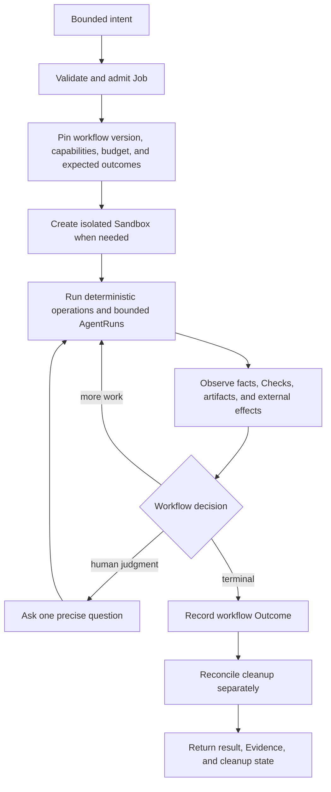

# Dorf North Star — Durable Agent Jobs

Dorf is the open-source control plane for durable agent Jobs on infrastructure you control.

It lets clients build workflows that use deterministic code for knowable work and isolated agents
for judgment, with recovery and evidence built in. The user delegates a bounded goal, may disappear,
and later receives an honest result without managing the agent process, Sandbox, retries, external
effects, or cleanup.

This is the product and experience direction. It is not an API inventory, schema, package plan, or
issue backlog. The currently verified product is narrower: one coding-to-PR workflow using Codex in
Incus, with Git and GitHub as deliverable authorities. Multiple Harnesses, Sandbox providers, and
workflow-authoring surfaces remain direction until real implementations validate their seams.

## Ten-second model

```text
A client delegates a goal-backed Job.
A workflow uses code for facts and agents for judgment.
The Job owns isolated resources, recovery, and external effects.
Dorf returns an outcome with observed evidence and honest cleanup state.
```

## Product boundary

Dorf is for delegated work that is too stateful, long-running, or dangerous for a prompt or ordinary
automation graph: work that needs a real workstation, powerful tools, durable recovery, controlled
credentials, reconciled external effects, and trustworthy inspection.

Dorf does not own the user's memory, priorities, or cross-Job life. A personal assistant such as
Agent0, a CLI, CI, or another trusted client decides what to delegate and how separate Jobs compose.
A workflow owns the meaning of one Job. Dorf owns custody of its execution.

This gives each layer one job:

```text
Client       chooses goals and composes Jobs
Workflow     defines semantics, policy, evaluation, and outcomes
Dorf core    owns durable custody, facts, recovery, and cleanup
Adapters     translate Harnesses, Sandboxes, providers, and external authorities
```

## Vocabulary

| Term | Meaning |
| --- | --- |
| **Job** | One durable bounded goal, its workflow version, lifecycle, and explicit outcome |
| **Workflow** | Ordinary versioned policy that composes deterministic operations and AgentRuns for one kind of Job |
| **Sandbox** | An isolated mutable workstation owned for a Job's lifetime |
| **Message** | Durable input from a human, agent, or workflow |
| **AgentRun** | One bounded delivery of a Message to an agent, with exact Harness binding and outcome |
| **Harness** | Software hosting an agent, such as Codex app-server |
| **Thread** | Continuing conversation context owned by a Harness |
| **Turn** | One request/response cycle in a Harness Thread |
| **Role** | The bounded responsibility and capability envelope of an AgentRun |
| **Action** | Code-owned work that changes external state and must be reconciled safely |
| **Check** | Code-owned observation or assertion |
| **Evidence** | Immutable observed proof tied to the fact it supports |
| **Outcome** | The workflow-specific terminal result, separate from resource cleanup |

Coding adds workflow facts such as Revision, ReviewPlan, Proposal, and GitHub acceptance. Research
may add a scoped request, captured sources, and a report outcome. Those facts do not become core
vocabulary merely because one workflow needs them.

`Role` is a field, not an executing object. There is no first-class Worker until personality,
capability, reputation, ownership, or memory must persist across Jobs. A standing "researcher" or
"simplifier" may begin as client configuration that creates bounded Jobs; repeated use must earn a
durable cross-Job identity.

## High-level flow



Each workflow keeps its decision small and explicit in ordinary code. Dorf is not a configurable DAG
engine: Absurd owns generic task execution mechanics, while Dorf and the workflow retain the product
facts needed to explain and recover the Job.

## Two examples

### Coding to a verified proposal

A client delegates a complete coding goal. The coding workflow creates an isolated clone and branch,
runs repository setup, lets an implementation AgentRun commit, observes an exact Revision, runs
deterministic Checks, selects only useful review, and publishes an exact-Revision pull request.
GitHub merge, close, or explicit abandonment supplies the workflow outcome; cleanup remains a
separate observable fact.

### Research to an evidence-backed answer

A personal assistant delegates a bounded question with source policy, budget, and report contract.
The research workflow captures sources and deterministic metadata, uses an AgentRun for search and
synthesis, checks citations and output shape programmatically where possible, and returns either a
report, an honest no-result, or precise attention. It owns no branch or pull request. The client may
use the result to answer the user or admit another Job.

The second example is direction, not current support. Building it as a real vertical slice is how
Dorf discovers which coding-era mechanisms form a smaller common application boundary.

## Deterministic and agentic boundary

| Programmatic and deterministic | Agentic judgment |
| --- | --- |
| Validate input, identity, authority, capabilities, and budget | Understand an ambiguous goal and unfamiliar material |
| Create, inspect, and destroy Sandboxes | Choose an approach within the accepted envelope |
| Sequence durable input and reconcile retries | Implement, investigate, synthesize, or review |
| Run declared commands, schemas, probes, and policy rules | Interpret evidence that has no complete mechanical rule |
| Observe external authorities and retain artifacts | Explain uncertainty and material decisions |
| Hash, pin, invalidate, and render Evidence | Decide how to respond to human, Check, or reviewer Messages |
| Reconcile external effects and cleanup | Request human judgment when no safe default exists |

This boundary is a product promise: agent context is not spent rediscovering facts that code can
establish, and deterministic mechanisms do not pretend to answer questions requiring judgment.

Agent prose remains a Message or workflow result, not Evidence. Evidence proves observed facts: a
Harness completed a Turn, a command returned an exit status, a source was captured, a Revision was
observed, or an external authority contains an exact object. Fluent output never becomes its own
proof.

## Desired experience

- **One delegation:** the client supplies a complete bounded goal, not orchestration instructions.
- **Detached by default:** watching a terminal or token stream is optional.
- **Calm recovery:** client, controller, executor, and agent process loss do not erase accepted input
  or create competing work.
- **Dangerous work, bounded:** secrets, network, filesystem access, external writes, spend, and
  destructive operations are explicit capabilities.
- **Situation first:** inspection shows the goal, observed history, current work or attention,
  result, Evidence, and cleanup without exposing executor internals by default.
- **Precise interruption:** humans are asked only for consequential decisions or genuine ambiguity
  without a safe default.
- **Honest terminal:** workflow outcome and cleanup remain separate until both have converged.
- **Owner-controlled deployment:** local, on-premise, or deliberately chosen managed infrastructure
  may host the system without making Dorf's cloud an authority.

## Layers and ownership

```text
L0  Existing tools       Harnesses, Sandbox providers, source hosts, APIs, provider SDKs
L1  Deterministic edge   Actions, Checks, capability enforcement, adapters
L2  Durable custody      Job identity, inbox, AgentRuns, Evidence, recovery, cleanup
L3  Workflows            coding first; later concrete workflows prove reusable seams
L4  Clients and triggers CLI and Agent0 first; CI, webhooks, MCP, schedules, and UI later
```

Clients translate intent or external events into idempotent Job admission; they do not become
workflow authorities. Trigger breadth is not a core feature. A CLI, GitHub event, schedule, Slack
command, or personal assistant should eventually invoke the same application boundary.

## Workflow authoring and evaluation direction

The intended authoring unit is a versioned, inspectable workflow contract:

- typed input and workflow-specific outcomes;
- required Harness, Sandbox, connections, credentials, and capabilities;
- deterministic operations and external effects;
- bounded AgentRun judgment points;
- budgets and human-attention boundaries;
- Checks, evaluation cases, and honest terminal conditions; and
- source, version, provenance, and upgrade policy.

Agents and developers should author ordinary code with excellent scaffolding, machine-readable
contracts, fixtures, local evaluation, and diagnostics. An agent may propose workflow changes, but a
new version must pass its checks and evaluations and receive any required capability approval before
activation. Humans must be able to inspect, edit, fork, pin, and roll back what the agent built.

Coding plus one second real workflow may justify an internal common API. A public authoring API is
earned only after another implementation or external author exercises it. Share source-controlled,
pinned workflow bundles before inventing a marketplace.

## Current verified slice

The supported product today is one Go application using PostgreSQL and Absurd, one coding workflow,
Incus as its Sandbox provider, Codex app-server as its Harness, and Git/GitHub as proposal and
acceptance authorities. This narrow support claim is evidence, not the permanent product boundary.

The current coding implementation may contain repository, Revision, review, and GitHub fields in
records that look core-shaped. Do not preserve or make them optional merely to claim generality. A
second workflow should add its natural facts first; only observed duplication earns extraction.

## Non-goals until evidence demands them

- a visual automation canvas or user-programmable DAG;
- an AI-company org chart, autonomous hierarchy, or swarm runtime;
- opaque prompt-generated workflows that humans cannot inspect or edit;
- a plugin or workflow marketplace before versioning, capabilities, provenance, and evaluations;
- speculative matrices of Harnesses, Sandboxes, models, languages, and providers;
- one mutable Sandbox shared by unrelated simultaneous Jobs;
- persistent Worker personalities or cross-Job memory without a real consumer;
- a mandatory agent review ritual when deterministic Checks suffice;
- compatibility with superseded Python, SQLite, Worker, Room, or Assignment representations; and
- preservation or migration of pre-release local data.

## Proof that the North Star is real

Dorf's durable custody is real when a client can admit a bounded Job, disappear, and later recover
an evidence-backed outcome without duplicate agent Turns, Sandboxes, external effects, or results.
Messages accepted during work remain ordered, ambiguous effects reconcile against their authority,
and cleanup is retryable and honest.

Dorf's building-block claim is real only when at least two materially different workflows—starting
with coding and a candidate such as research—reuse a smaller common surface without forcing their
domain facts into one generic schema. A stranger or another application can then build and invoke a
third workflow through documented contracts, evaluate it, and understand its authority without
learning Absurd internals, provider secrets, Sandbox names, or Harness protocol.
