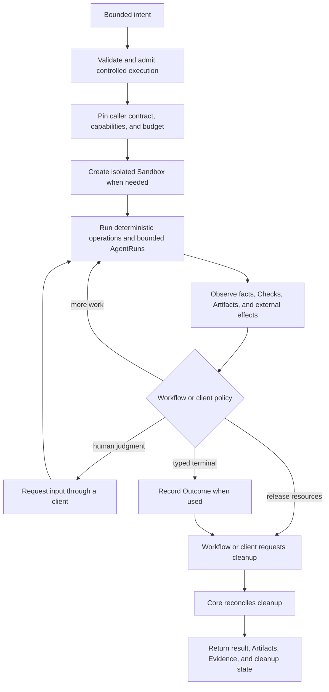

# Dorf North Star — Portable, Controlled Agent Execution

Dorf is the open-source control plane for running agent harnesses on infrastructure you control.

**Your agents. Your infrastructure. One API.**

The direction is to bring a verified Harness version and configuration, its skills, extensions or
plugins, project instructions, workspace image or setup and dependencies, and vendor-supported
connection into compatible isolated infrastructure. Operators should be able to choose verified
local, bring-your-own-cloud, or managed profiles without rebuilding the agent system they trust.
Connection custody does not mean copying raw user secrets into a Sandbox; each profile and adapter
must define scoped routing or injection.

Dorf owns the control-plane guarantees around the Harness: accepted intent, AgentRun and Sandbox
custody, external-effect reconciliation, recovery, Evidence, durable attachment of a typed Outcome
when the consumer defines one, and execution of requested cleanup. A Harness may provide its own
durable sessions; Dorf does not compete by duplicating them.

This is the product and experience direction. It is not an API inventory, schema, package plan, or
issue backlog. Current support claims and operator steps belong in the README and getting-started
guide; implementation detail belongs in code.

## Ten-second model

```text
A client selects a verified Harness and Sandbox profile, then drives Core directly or delegates
policy to a workflow. Dorf owns controlled execution, isolated resources, recovery, retained facts,
and requested cleanup. The client or workflow owns what the work means.
```

## Product boundary

This section is the sole current authority for ownership between Core, workflows, and clients.
Architecture documents its technical consequences; the Decision Log records why it changed; other
documents should link here rather than redefine it.

Dorf Core is the product: a stateful, self-hostable control plane with one application boundary for
supported existing Harnesses on chosen compatible infrastructure. It is deployed with its durable
dependencies rather than embedded as a runtime library. Portability is capability-based: admission
selects a verified profile and rejects combinations whose configuration, dependencies, credentials,
host constraints, tools, isolation, recovery, or observation contract has not been proved.

Dorf does not own the user's memory, priorities, or cross-Job life. A personal assistant such as
Agent0, a CLI, CI, or another trusted client decides what to delegate and how separate Jobs compose.
A workflow owns Job semantics, policy, evaluation, and what its Outcome means. Dorf owns custody of
execution and durable attachment of that Outcome. A client may instead drive Core mechanisms
directly and retain that policy itself. Native Dorf workflows call the same application contract
in-process; external clients use a supported transport. Neither receives a privileged hidden path.
Language SDKs, when earned, are thin clients for a running Dorf deployment rather than embedded Dorf
runtimes.

Core provides mechanisms, never workflow or interaction policy. It may admit input, run and recover
AgentRuns, retain Artifacts and Evidence, and reconcile cleanup after a caller requests it. It does
not decide that a draft is accepted, that a Job is semantically finished, that another Job should be
started, or that resources should now be released. Those choices belong to a workflow or to a client
such as Agent0, n8n, a UI, CI, or a human-operated CLI. Shipping a native workflow in the same
repository, process, or binary does not move its policy into Core.

Apply this test before adding a Core concept: if the proposed fact or operation interprets
acceptance, rejection, success, terminal meaning, human judgment, cross-Job composition, or when to
clean up, first place it in the consuming workflow or client. Core should retain only the reusable
custody or lifecycle mechanism that remains after that policy is removed.

This gives each layer one job:

```text
Client       chooses goals, drives Core directly, or composes Jobs through workflows
Workflow     owns semantics, policy, evaluation, and Outcome meaning
Dorf core    owns Job-wide run custody, result attachment, recovery, evidence, and requested cleanup execution
Adapters     translate Harnesses, Sandboxes, providers, and external authorities
```

## Vocabulary

| Term | Meaning |
| --- | --- |
| **Job** | One durable bounded goal, its accepted execution contract, owned resources, and lifecycle; workflow-driven Jobs also pin a workflow version |
| **Workflow** | Ordinary versioned policy that composes deterministic operations and AgentRuns for one kind of Job |
| **Sandbox** | An isolated mutable workstation owned for a Job's lifetime |
| **Message** | Durable input from a human, agent, or workflow |
| **AgentRun** | One bounded delivery of a Message to an agent, with exact Harness binding and outcome |
| **Harness** | Software hosting an agent, such as Codex app-server |
| **Thread** | Continuing conversation context owned by a Harness |
| **Turn** | One request/response cycle in a Harness Thread |
| **Role** | The bounded responsibility and capability envelope of an AgentRun |
| **Action** | Code-owned work that changes external state and must be reconciled safely |
| **Check** | Code-owned observation or assertion |
| **Artifact** | An immutable named deliverable retained for a Job and retrievable by clients |
| **Evidence** | Immutable observed proof tied to the fact it supports |
| **Outcome** | A typed consumer-defined terminal result, when used, separate from resource cleanup |

Coding adds workflow facts such as Revision, ReviewPlan, Proposal, and GitHub acceptance. Research
may add a scoped request, captured sources, and draft Artifacts. Those facts do not become core
vocabulary merely because one workflow needs them.

`Role` is a field, not an executing object. There is no first-class Worker until personality,
capability, reputation, ownership, or memory must persist across Jobs. A standing "researcher" or
"simplifier" may begin as client configuration that creates bounded Jobs; repeated use must earn a
durable cross-Job identity.

## High-level flow



Each workflow or client keeps its policy small and explicit in ordinary code. Dorf is not a
configurable DAG engine: Absurd owns generic task execution mechanics, while Dorf and its consumers
retain the product facts needed to explain and recover the Job.

## Two examples

### Coding to a verified proposal

A client delegates a complete coding goal. The coding workflow creates an isolated clone and branch,
runs repository setup, lets an implementation AgentRun commit, observes an exact Revision, runs
deterministic Checks, selects only useful review, and publishes an exact-Revision pull request.
GitHub merge, close, or explicit abandonment supplies the workflow outcome; the workflow then
requests cleanup, which remains a separate observable fact.

### Codebase investigation to a repository-grounded report

A client delegates an exact reachable or locally committed repository Revision and an unstructured
investigation brief. The workflow creates an isolated exact checkout, uses a bounded AgentRun for
inspection and synthesis, checks its completed Turn and unchanged checkout programmatically, and
retains a flexible Markdown draft. An honest draft may simply explain that no useful finding exists.
The workflow accepts follow-up Messages in the same Harness Thread and retains each revised draft.
A client decides whether to request another draft, publish or otherwise consume one, start another
workflow, or ask Core to clean up. Investigation owns no accept/reject policy, publication, pull
request, or cleanup timing.

## Deterministic and agentic boundary

| Programmatic and deterministic | Agentic judgment |
| --- | --- |
| Validate input, identity, authority, capabilities, and budget | Understand an ambiguous goal and unfamiliar material |
| Create, inspect, and destroy Sandboxes | Choose an approach within the accepted envelope |
| Sequence durable input and reconcile retries | Implement, investigate, synthesize, or review |
| Run declared commands, schemas, probes, and policy rules | Interpret evidence that has no complete mechanical rule |
| Observe external authorities and retain Artifacts | Explain uncertainty and material decisions |
| Hash, pin, invalidate, and render Evidence | Decide how to respond to human, Check, or reviewer Messages |
| Reconcile external effects and cleanup | Request human judgment when no safe default exists |

This boundary is a product promise: agent context is not spent rediscovering facts that code can
establish, and deterministic mechanisms do not pretend to answer questions requiring judgment.

Agent prose remains a Message, workflow result, or Artifact, not Evidence. Evidence proves observed
facts: a
Harness completed a Turn, a command returned an exit status, a source was captured, a Revision was
observed, or an external authority contains an exact object. Fluent output never becomes its own
proof.

## Desired experience

- **One delegation:** the client supplies a complete bounded goal, not orchestration instructions.
- **Low-friction isolation:** a verified profile should carry the agent setup that already works into
  chosen isolated infrastructure instead of making the operator rebuild it in a new framework.
- **Detached by default:** watching a terminal or token stream is optional.
- **Calm recovery:** client, controller, executor, and agent process loss do not erase accepted input
  or create competing work.
- **Dangerous work, bounded:** secrets, network, filesystem access, external writes, spend, and
  destructive operations are explicit capabilities.
- **Situation first:** inspection shows the goal, observed history, current work or attention,
  result, Artifacts, Evidence, and cleanup without exposing executor internals by default.
- **Precise interruption:** humans are asked only for consequential decisions or genuine ambiguity
  without a safe default.
- **Honest terminal:** workflow outcome and cleanup remain separate until both have converged.
- **Owner-controlled deployment:** local, on-premise, or deliberately chosen managed infrastructure
  may host the system without making Dorf's cloud an authority.

## Layers and ownership

```text
L0  Existing tools       Harnesses, Sandbox providers, source hosts, APIs, provider SDKs
L1  Deterministic edge   Actions, Checks, capability enforcement, adapters
L2  Durable custody      Job identity, inbox, AgentRuns, Artifacts, Evidence, recovery, requested cleanup
L3  Core consumers        clients, external products, and native workflows
L4  Triggers and views    translate intent and render the same Job facts
```

Clients may own interaction and composition policy around Jobs, but they do not silently reinterpret
a pinned workflow's internal facts or become authority for its semantics. Trigger breadth is not a
Core feature. A CLI, GitHub event, schedule, Slack command, or personal assistant should eventually
invoke the same application boundary.

## Native workflows as Core dogfood

The intended authoring unit is a versioned, inspectable workflow contract:

- typed input and workflow-specific outcomes;
- required Harness, Sandbox, connections, credentials, and capabilities;
- deterministic operations and external effects;
- bounded AgentRun judgment points;
- budgets and human-attention boundaries;
- Checks, evaluation cases, and honest terminal conditions; and
- source, version, provenance, and upgrade policy.

Agents and developers should author ordinary code with excellent scaffolding, machine-readable
contracts, fixtures, local evaluation, and diagnostics. An agent may propose workflow changes, but a
new version must pass its checks and evaluations and receive any required capability approval before
activation. Humans must be able to inspect, edit, fork, pin, and roll back what the agent built.

Native workflows should compose the same intended Core contract that external clients invoke.
Transport, client SDK, and public compatibility promises remain uncommitted until real
external-client use proves them. Dynamic agent-authored recipes are a later UX layer, not the
requirements driver for Core. Dorf does not become a generic automation canvas, graph framework,
agent builder, or model/tool Harness.

Native workflows remain Core consumers even when compiled into the Dorf binary. They may own rich
domain policy, terminal conditions, and cleanup requests, but that policy must remain outside the
Core contract and must not create a privileged execution path.

## Non-goals until evidence demands them

- a visual automation canvas or user-programmable DAG;
- an AI-company org chart, autonomous hierarchy, or swarm runtime;
- opaque prompt-generated workflows that humans cannot inspect or edit;
- a plugin or workflow marketplace before versioning, capabilities, provenance, and evaluations;
- speculative matrices of Harnesses, Sandboxes, models, languages, and providers;
- one mutable Sandbox shared by unrelated simultaneous Jobs;
- persistent Worker personalities or cross-Job memory without a real consumer;
- a mandatory agent review ritual when deterministic Checks suffice;
- compatibility with superseded Python, SQLite, Worker, Room, or Assignment representations; and
- preservation or migration of pre-release local data.

## Proof that the North Star is real

Dorf's durable custody is real when a client can admit a bounded Job, disappear, and later recover
its typed result, Artifacts, and supporting Evidence without duplicate agent Turns, Sandboxes,
external effects, or results.
Messages accepted during work remain ordered, ambiguous effects reconcile against their authority,
and cleanup is retryable and honest.

Dorf's portability claim is real when common consumer and workflow code has no Harness- or
Sandbox-specific branches beyond profile selection and capability admission. D063 records the
current proof order.

Mac-like environments and sensitive enterprise experimentation motivate future profiles, but they
are not current support claims. General workflow authoring follows portability proof; it does not
lead it.
