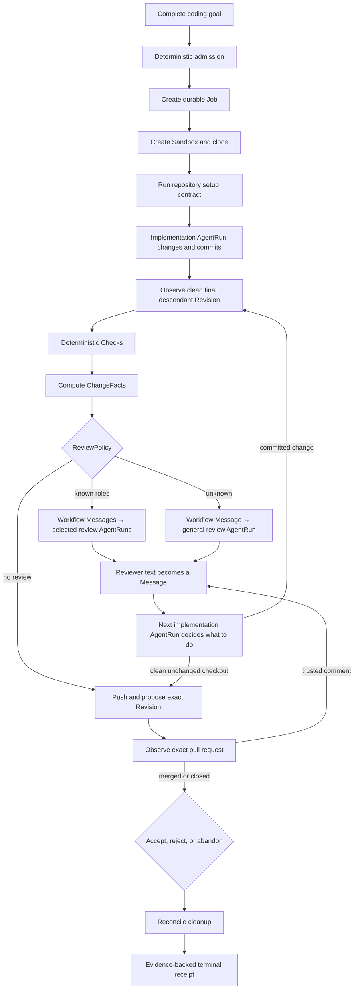

# Dorf North Star — Durable Coding Jobs

Dorf accepts a complete coding goal, carries it durably through an isolated Sandbox, uses programs
for knowable work and agents for judgment, and returns an exact-Revision proposal with evidence.

This is the product and experience direction. It is not an API inventory, schema, package plan, or
issue backlog. Concrete implementation follows the greenfield architecture and live GitHub epic.

## Ten-second model

```text
A Job changes code in a Sandbox.
Actions change external state; Checks observe it.
AgentRuns do judgment and retain exact harness bindings.
Evidence proves claims about a Revision.
```

## Vocabulary

| Term | Meaning |
| --- | --- |
| **Job** | The durable user goal and lifecycle, from admission to explicit terminal outcome |
| **Sandbox** | The isolated mutable machine and checkout boundary for one Job |
| **Revision** | The exact immutable commit being implemented, checked, reviewed, or proposed |
| **AgentRun** | The complete durable delivery record for one Message and its exact harness binding |
| **Harness** | The software hosting an agent, such as Codex app-server |
| **Thread** | A continuing harness conversation that AgentRuns may reuse |
| **Turn** | One request/response cycle in a harness Thread, bound durably to its AgentRuns |
| **Role** | The bounded responsibility of an AgentRun, such as implement, general review, QA, or security |
| **Action** | Code-owned work that changes external state |
| **Check** | Code-owned observation or assertion |
| **Evidence** | Immutable observed proof tied to a Revision, AgentRun, or lifecycle fact |

`Role` is a field, not an executing object. There is no `RoleRun`. An agent executes in a Role.
`Thread` and `Turn` are harness identities retained for exact recovery. There is no first-class
Worker until identity or memory must survive across Jobs.

## High-level flow



Review is optional and explainable. Deterministic policy selects known specialist Roles and uses one
general reviewer for an unknown change. Each selected review begins as an ordinary workflow Message;
its review AgentRun consumes that Message. Each reviewer returns ordinary text. Dorf sends that text
as a Message through the implementation AgentRun path; it does not parse a universal review result.
The implementation agent decides whether to act, explain, or leave the Revision unchanged. No agent
replaces the durable Job as coordinator.

Agent prose remains a Message. Evidence records observed facts, including the harness observation of
an AgentRun's exact Thread and Turn; reviewer prose is not copied into a second Evidence artifact.

The pull request is the acceptance UI. A comment from the repository owner or a collaborator becomes
an ordinary human Message to the same implementation AgentRun path. Dorf acknowledges accepted
feedback with an eyes reaction and, after the normal checks and review flow republishes, replies with
the exact Revision that handled it. Merging the exact pull request accepts the Job; closing it without
merging rejects the Job. Explicit abandonment remains a Dorf command.

## The deterministic and agentic boundary

| Programmatic and deterministic | Agentic judgment |
| --- | --- |
| Validate input and authority | Understand the goal and codebase |
| Allocate stable identities, FIFO follow order, and explicit steer priority | Design and implement the change |
| Create, inspect, and destroy Sandboxes | Resolve ambiguity with documented assumptions |
| Clone, set up, observe the final Revision, diff, push, and publish | Decide whether an unfamiliar change needs specialist review |
| — | Create one or many commits in an implementation AgentRun |
| Run declared tests, linters, smoke checks, and probes | Perform QA, security, architecture, or performance review |
| Compute ChangeFacts and apply known review rules | Decide what to do with user, Check, or reviewer Messages |
| Hash, pin, invalidate, and render Evidence | Explain material decisions and remaining uncertainty |
| Retry, reconcile, and report external effects | — |

This boundary is a product promise: agent context is not spent rediscovering facts that code can
establish, and deterministic mechanisms do not pretend to answer questions requiring judgment.

## Desired experience

- **One delegation:** the user supplies a complete goal, not orchestration instructions.
- **Detached by default:** watching a terminal or token stream is optional.
- **Calm recovery:** client, controller, and task-executor loss pause progress but do not erase accepted
  input or create competing Jobs.
- **Situation first:** inspection shows current goal, observed state, claims, Evidence, and required
  attention before logs.
- **Precise interruption:** humans are asked only for consequential boundary decisions or genuine
  ambiguity without a safe default.
- **One proposal:** a coding Job owns its Sandboxes, branch, Revision line, and pull-request proposal.
- **Honest terminal:** completion, rejection, abandonment, and cleanup are separate observable facts
  until all have converged.

## Layers and ownership

```text
L0  Existing tools       Git, GitHub, Incus, agent harnesses, provider SDKs
L1  Deterministic edge   Actions, Checks, Sandbox and Harness adapters
L2  Durable core         Job facts, inbox, Absurd execution, recovery
L3  Coding workflow      admission, implementation, review policy, evidence, proposal, terminal
L4  Clients              CLI first; other trusted clients later
```

The durable core owns mechanisms and facts. The coding workflow owns coding semantics and review
policy. Adapters translate existing tools; they do not create a second workflow. Clients invoke and
render the same application boundary; they do not become authorities.

Resource ownership follows lifetime: the Job owns every Sandbox created for the task; each Sandbox
owns its scoped Provider Route; AgentRuns use a Sandbox. Cleanup walks Job → Sandboxes → Routes.

## Non-goals until evidence demands them

- persistent Worker personalities or cross-Job memory;
- multiple simultaneous Jobs sharing one mutable Sandbox;
- a general workflow builder or user-programmable DAG;
- a provider or agent plugin marketplace;
- speculative Sandbox, agent, model, or language matrices;
- mandatory review after every change;
- Dagger or another nested build runtime for repositories whose direct commands suffice;
- fleet dashboards, organizational metaphors, or autonomous agent hierarchies;
- compatibility with the superseded Python, SQLite, Worker, Room, or Assignment implementation;
- preservation or migration of old local data.

## Proof that the North Star is real

A stranger on a clean machine can delegate one real change and later inspect an evidence-backed
pull-request proposal. During the run, the controller and task executor can be killed and restarted,
a message can be accepted while the agent is active, selected review can feed the implementation
AgentRun path through a Message, and cleanup can be retried. No duplicate Job, Sandbox, harness Turn,
branch, or pull request appears, and the user never has to understand Absurd, PostgreSQL rows, Incus
names, or harness protocol details.
