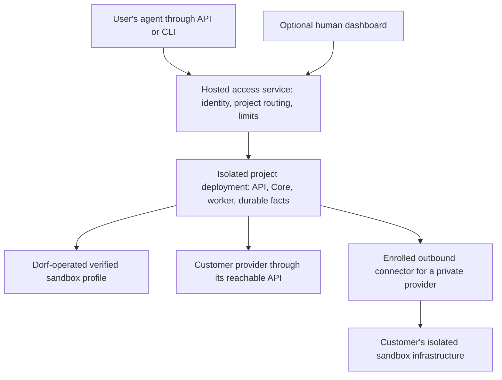

# Agent-first developer experience, API vocabulary, and hosted Dorf

Status: research and proposals, recorded 2026-09-11. This document captures the DX comparison and
possible next steps. It does not change the supported API, accept an architecture, or commit to a
hosted service. Cloudflare provides inspiration for infrastructure that agents can discover and
operate directly. OpenAI's Agents API provides a reference for familiar names, verbs, and
interaction patterns. Dorf owns its API contract; OpenAI SDK compatibility and drop-in replacement
are outside this proposal's scope.

The [documentation map](../README.md) identifies current authorities. In particular, the
[product boundary](../project/north-star.md#product-boundary) governs what belongs in Core,
the [Control API](../control-api.md) owns the client contract, and
[Support](../support.md) owns proved deployment and recovery capabilities.

## Assessment

OpenAI currently offers the shorter path for a developer building an agent-powered application.
Its [quickstart](https://developers.openai.com/api/docs/guides/agents-api/quickstart) supplies SDK
examples that create a session, submit initial input, and stream work in a hosted sandbox. Dorf's
CLI is approachable once a deployment exists, but developers using HTTP must assemble more of the
interaction themselves.

There are three related directions to evaluate:

1. Design infrastructure interfaces for agents as primary users, with human oversight as a
   secondary interface.
2. Use familiar vocabulary, verbs, and interaction patterns to reduce developer learning effort.
3. Operate Dorf as an optional hosted service when customers need managed operation.

None requires moving the harness outside the workload sandbox. Harness placement, API design,
and who operates the service should be evaluated independently.

## Demand guides investment

The current system serves the maintainer's needs well. Prioritize friction observed in that real
use, especially setup, monitoring, diagnosis, and recovery visibility. Improving those workflows
is useful even before external users arrive.

This evaluation has not established customer demand for hosted Dorf or additional infrastructure
attachment. The designs below are options to revisit when a user has a concrete need. They are not
a scheduled roadmap, and an OpenAI feature or familiar API name is not by itself a reason to build
new behavior.

For a proposed expansion, identify the user, the task they cannot complete comfortably today, and
the smallest change they will actually try. Use their results to decide the next investment.
Completion of an earlier improvement does not automatically justify the next one. Public naming
work remains API inspiration; it does not create an SDK compatibility commitment.

## Agents as primary users

Dorf is infrastructure. Design its setup and operating experience so that a user's existing agent
can discover capabilities, run work, inspect state, diagnose failures, and request cleanup through
supported interfaces. The human chooses the objective and delegated authority. The agent operates
Dorf within that authority; policy remains with the client or workflow under the
[product boundary](../project/north-star.md#product-boundary).

Cloudflare is the reference for this interface direction. Its
[agent setup documentation](https://developers.cloudflare.com/agent-setup/codex/) combines skills,
API access through MCP, CLI operations, and Markdown documentation with compact indexes. It also
describes a preview unified CLI with consistent verbs and output designed for agents. The lesson
for Dorf is to make infrastructure discoverable and operable from the agent's existing tools.
The proposed priority for Dorf's dashboard is our design choice, not a claim about Cloudflare's
dashboard strategy.

Build on Dorf's existing [Agent Guide](../agent-guide.md), structured CLI receipts, and OpenAPI
contract. Select improvements against real operating tasks:

| Need | Proposed interface standard |
| --- | --- |
| Discovery | A short entry point leads to the relevant procedures, available profiles, supported operations, and their prerequisites |
| Setup | Authorized setup can run without prompts, resume after interruption, and report the exact missing credential, permission, or human action when blocked |
| Execution | Consistent verbs, stable handles, structured output, and clear accepted, running, settled, and cleanup states let the agent continue without interpreting terminal prose |
| Recovery | Document retry identity, reconnect behavior, and actionable errors so an agent can recover from an interrupted request without duplicating work |
| Observation | Health, execution state, resource ownership, and diagnostic evidence are available through the appropriate supported operator or client interface |
| Context use | Return bounded summaries first, with filters and explicit references for deeper inspection |

Preserve the Agent Guide's distinction between deployment-host operation and remote-client access.
An agent connected as a client should not need deployment SSH or database access to complete a
supported client task. Add a skill, MCP server, or client wrapper only when an actual consumer
needs that access path; the existing CLI and API are the starting point.

A possible human dashboard is secondary: make health, active work, failures needing attention,
results, and resource state easy to inspect at a glance. It should use the same supported
application boundary, and operational actions should also be available to authorized agents.
Human decisions and approvals belong to the consuming client or workflow. Build dashboard views
when they resolve observed monitoring friction.

Evaluate the experience with a fresh agent given only the published entry point and the access
appropriate to its role. It should complete the authorized setup or connection path, submit work,
wait, retrieve a result, reconnect after interruption, diagnose a failed operation, and request
cleanup. Record where a person had to supply undocumented knowledge; use those gaps to choose the
next change.

## Developer experience improvements

The detailed current behavior lives in the [Control API](../control-api.md) and
[getting-started guide](../getting-started.md). These are candidates to select against observed
friction, not a requirement to implement every row.

| Priority | Improvement | Current friction | Proof of improvement |
| --- | --- | --- | --- |
| Current use | Improve setup and monitoring from actual operating friction | The maintainer identifies these as opportunities; specific failures or confusing steps still need to be recorded | An observed setup or diagnosis task becomes easier, with a clear current state and next action |
| Onboarding | Separate client onboarding from deployment operation | A newcomer encounters infrastructure setup before the existing-deployment path | A new client can find connection instructions, run one task with defaults, and retrieve its result without reading operator procedures |
| Onboarding | Put one short successful walkthrough before the command inventory | The guide mixes the happy path with optional operations and configuration | Copying the walkthrough works verbatim and explains each returned ID only when needed |
| First integration | Provide one complete HTTP example and a small reusable client helper | OpenAPI describes the contract but leaves submission, waiting, replay, and results to each developer | A Python or TypeScript example creates work, sends input, waits, retrieves the answer, continues, and requests cleanup |
| Consumer-driven | Make result and file retrieval discoverable | A client needs a known Message ID or an exact sandbox path | The client can find the answer and advertised outputs from the returned session or Job handle |
| Consumer-driven | Define retained output behavior | Live workspace files become unavailable during cleanup | A client can distinguish temporary workspace files from intentionally retained artifacts and knows their retention and deletion rules |
| Consumer-driven | Expose sufficient conversation and tool history for an interactive client | Job snapshots and settled Message results do not provide a native conversation browser | Reopening a client reconstructs supported messages and tool items from authoritative history |
| Consumer-driven | Add suitable live events and background notifications | Snapshot watch is useful for status, but does not deliver a complete agent activity feed or webhooks | A real client can show progress, recover after disconnect, and learn about completed work while detached |

The initial helper should hide routine idempotency-key generation, preserve keys across ambiguous
retries, retain Job and Message IDs, and distinguish accepted input from a completed answer.
It can compose existing operations; a convenient one-call client method does not require combining
Job and Message admission inside Core.

Fix the walkthrough's `goal.txt`/`message.txt` mismatch. Show the default profile and model path
before named overrides. Keep coding-only operations such as abandonment out of the direct-Job
happy path. These are documentation defects, not reasons to redesign execution.

Preserve the useful parts of Dorf's DX: verified profiles, structured CLI receipts, stable Problems,
explicit queued follow and exact-target steer, retry identity, and observable cleanup.

OpenAI's richer event interface also requires client work. Its
[event recovery procedure](https://developers.openai.com/api/docs/guides/agents-api/sessions/events)
reopens the stream, retrieves saved items, and reconciles buffered updates. Do not promise event
replay or perfect tool history merely because the API exposes streaming.

## Familiar vocabulary and verbs

Use common terms where their meanings agree. A developer familiar with another agent API should
recognize ordinary operations and predict how to use Dorf. Evaluate names by how much explanation
they save. Do not rename distinct Dorf concepts into apparently equivalent objects that behave
differently, or introduce resources simply because OpenAI has them.

| Familiar term | Possible Dorf mapping | Important limit |
| --- | --- | --- |
| Agent | Reusable model, instructions, and tool configuration owned by the client-facing service | A Sandbox Profile also includes infrastructure and verification; it is not an Agent. A Role is not an Agent either |
| Session | A direct Job projected with its selected native Harness Thread | A workflow Job can own several Sandboxes and Threads and carry workflow outcomes; it is not universally one Session |
| Turn | The native Harness Turn | A steer Message joins a Turn. An AgentRun is a delivery/recovery record, so neither is a one-to-one substitute for a Turn |
| Message or item | A supported input or a projection of native conversation/tool history | Delivery records, native items, and retained Evidence have different authorities |
| Environment or sandbox | The execution environment backed by a Job-owned Sandbox | An environment configuration/template is not the live resource. No-environment execution is not established by the current Sandbox-bound Agent handle |
| Artifact | An explicitly retained output file | Evidence proves an observation; it does not make every agent-generated file a verified claim |

OpenAI distinguishes [reusable Agent settings from Session state](https://developers.openai.com/api/docs/guides/agents-api/configuration).
Use that distinction in a proposed public interface without creating persistent worker identities or
cross-Job memory in Core.

### Familiar operations

These are naming candidates for a public interface or client helper, not new endpoints or a
decision to rename the existing API. Select one verb for each operation and use it consistently
across examples, documentation, and client methods.

| Verb | Developer expectation | Dorf behavior to preserve |
| --- | --- | --- |
| Create | Obtain a retained resource and its handle | Creation and initial Message admission remain distinct underneath any combined convenience method |
| List | Discover available resources | Return bounded pages with stable cursor rules |
| Retrieve | Read current state or a saved result | Return authoritative facts and distinguish pending work from a settled answer |
| Send | Submit input to continuing work | Explain the default busy/idle behavior and keep explicit follow and steer available |
| Stream | Observe work as it changes | State whether the stream carries snapshots, text, or tool events and how a client reconnects |
| Cancel or interrupt | Stop the specified work | Bind to the exact active Turn; do not imply deleting the conversation or releasing the Sandbox |
| Cleanup | Release owned execution resources | Retain the distinction between resource release and deletion of stored records |

Keep Job authority and workflow policy where they are. A public naming improvement does not
require renaming internal tables, changing the Harness protocol, or adding a compatibility adapter.
Use Dorf-specific names when they explain a meaningful difference, such as explicit cleanup.

Evaluate the proposed language through one small Dorf example and a newcomer walkthrough. Check
whether a developer can create work, send a follow-up, find the answer, and release resources
without learning recovery internals. Validate behavior against Dorf's own contract. Running an
OpenAI application unchanged, publishing a compatibility subset, and tracking upstream protocol
changes are not goals.

The [product boundary](../project/north-star.md#product-boundary) continues to govern new behavior.
Add tool callbacks, history, artifacts, or reusable configuration only when a Dorf client needs
them. An optional hosted service can own configuration, identity, and customer policy without
making those Core concepts.

## Hosted Dorf with optional customer infrastructure

This section sketches what a future service would require if customer demand justifies it. The
current priority is improving the existing system for its actual users.

The proposed first-use experience is: establish an account and scoped access, then let the user's
agent run the published example and retrieve an answer or artifact. Account authorization and
payment may require a human step; routine setup and operation should be available through agent
interfaces. A service-provided model connection and a preverified default
Sandbox profile avoid making provider setup the first task. Users can later select their own
infrastructure without rewriting their conversation code.

"Immediate" should mean no deployment or provider setup before the first request, not zero
provisioning latency. Measure time to accepted input, time to first useful output, and failed
onboarding attempts. Warm capacity is a later optimization if measurements justify it.

### Start with isolated deployments

For an initial hosted service, evaluate one isolated Dorf deployment per customer project. Reuse
the existing single-operator execution contract, but automate provisioning and routing. Separate
database authority, state, credentials, and workload resources between customers. Do not put
unrelated customers into one existing Deployment merely by issuing different Client keys:
[current Clients share an operator Principal](../control-api.md#client-and-authentication-boundary).

This starts with higher per-project overhead but avoids inventing shared multi-tenant custody
before the hosted workflow is proved. Isolation must cover the full resource set and authorization
path, not just HTTP routing. A shared deployment design could follow measured cost or scale needs;
it would require explicit tenant scoping throughout admission, reads, streams, storage, credentials,
provider identities, and background work.

The hosted service remains optional. Self-hosted users must retain a working deployment without a
Dorf cloud account. A managed control plane with customer compute still processes input, outputs,
and control metadata in the service; it is not equivalent to a fully self-hosted deployment.

### What must be added

| Area | First hosted-service requirement |
| --- | --- |
| Account access | Signup/login, project membership, scoped API credentials, revocation, and authenticated routing to the correct deployment |
| Default execution | Automated deployment setup, service-owned model access, a ready verified profile, provisioning health, and clear failure reporting |
| Client contract | One supported Dorf client helper/example, familiar names and verbs, and documented capabilities and lifecycle behavior |
| Session and output storage | A published retention contract; recoverable native history and selected artifacts when promised; tested backup/restore and deletion behavior |
| Usage and limits | Attributed model and sandbox usage, concurrency and spend limits, and enforceable trial or prepaid limits before opening arbitrary paid execution |
| Billing | A durable metering and reconciliation path; a defined distinction between Dorf-provided and customer-provided inference/compute |
| Workload isolation | Per-Job sandbox isolation, scoped secrets and network access, bounded resources, and protection of the service's own control endpoints |
| Service operation | Deployment health, upgrades, recovery drills, capacity management, failed-cleanup reconciliation, and enough diagnostics for customer support |
| Infrastructure attachment | Provider credentials or separately enrolled private-provider connectors, verification, health, revocation, and ownership-aware cleanup |

These are proposed service responsibilities, not claims that current Dorf implements them.
In particular, [optional execution telemetry](../support.md#optional-codex-execution-logs) is
best-effort observation and does not establish complete billing. Resource expiry policy also
belongs to the service or client: it requests cleanup through Core rather than making Core infer
cleanup from idleness.

Retain native history through its Harness authority. A persistence mechanism may preserve or
restore that authority; it should not create a second competing transcript in Dorf's Job tables.
Artifacts can be explicit immutable copies with their own retention rules. Conversation recovery
does not restore an unsaved file or restart a killed process.

OpenAI's [hosted sandbox contract](https://developers.openai.com/api/docs/guides/agents-api/environments/openai-hosted)
also separates live workspace lifetime from published artifacts. A comparable DX needs clear
lifetime rules, not a claim that every workspace lasts forever.

### Two ways to connect customer infrastructure

**Reachable provider API:** Start with a supported provider reachable by the hosted worker. Retain
the customer's scoped connection in protected service storage and create a verified profile from
it. The user selects that profile for new work; provider lifecycle stays in the existing adapter.
Account ownership alone does not supply the required network path or permissions.

**Private provider:** A host-side connector can establish an outbound authenticated path to one
administrator-prepared provider endpoint. This avoids requiring a publicly exposed provider
listener. It needs its own enrollment, revocation, reconnect behavior, and narrow endpoint map.
Use the [private-provider attachment playbook](private-provider-attachment.md) for the existing
proposal and proof criteria; no connector is currently implied by this document.

A provider connector and a sandbox executor solve different problems. The connector lets Dorf
create, inspect, and clean up provider resources; `exec-server` runs tools inside an already
attached environment. Connecting an executor alone does not give Dorf ownership of its host or a
way to create isolated workspaces. OpenAI likewise leaves self-hosted provisioning and lifecycle
with the application in its [self-hosted environment guide](https://developers.openai.com/api/docs/guides/agents-api/environments/self-hosted).

For Dorf's first attachment, prefer provider-backed isolated Sandboxes over granting an agent broad
access to a user's everyday machine. Prove both controller-to-provider/Harness access and
sandbox-to-model access. An outbound provider tunnel does not automatically establish the separate
[Provider Gateway route](../project/provider-gateway.md#network-boundary).

Selecting customer infrastructure for new sessions need not imply live migration of existing
sessions. Document that distinction. Detaching a provider should block new work while retaining
the identities needed to settle active work and cleanup; a disconnected host must remain visible
as unavailable, not falsely deleted. Attaching a host never authorizes deleting unrelated host
resources.

## Sequence when demand warrants it

1. **Improve current use.** Record and resolve concrete setup, monitoring, and diagnosis friction.
   Prioritize tasks the maintainer's agent can complete through supported interfaces. Add human
   dashboard views when they make observed monitoring tasks easier.
2. **Make the first external integration easier.** Improve onboarding and provide one end-to-end
   client example for someone trying Dorf. Use that walkthrough to review public names and verbs.
   Prove it against Dorf's own contract, including retry and result retrieval, and try it with a
   fresh agent using the published documentation.
3. **Consider a hosted pilot when a customer wants managed operation.** Establish the customer's
   workload and willingness to use the pilot before automating hosted deployments. Start with one
   default execution profile and prove account-to-first-result, isolation, bounded spend, restore
   behavior, and cleanup for the promised service.
4. **Connect customer infrastructure when an actual deployment requires it.** Choose a reachable
   provider account or a private-provider attachment based on that customer's constraints. Reuse
   an existing provider adapter and prove the same client flow, recovery, revocation, and cleanup.
5. **Expand from observed use.** Add history, callbacks, artifacts, or webhooks when a client needs
   them. Shared tenancy, multiple regions, broader provider support, and split-harness execution
   each need their own evidence. Stopping after any step is a valid outcome.

API familiarity and hosted-service scope can progress independently. Naming and documentation
improvements can be small. Recoverable sessions, billing, and public service operation are
substantial additions. Estimate them against explicit Dorf capabilities and measured operating
requirements.

When a proposal is selected, follow [the decision procedure](../../CONTRIBUTING.md#record-a-decision):
update the owner of each changed boundary and add a decision record. This research document remains
the dated evaluation, not a second current API or architecture authority.
